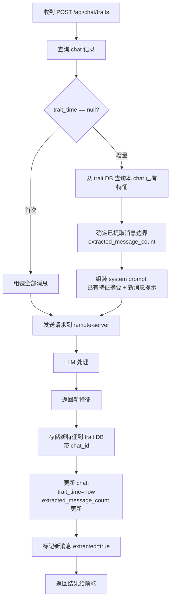

# 同一对话(chat)增量特征提取设计方案

> 讨论结论：对同一 chat 支持重复提取，但每次只增量处理新增消息。

## 1. 设计目标

对同一个对话（chat），支持**多次触发**特征提取，但每次只处理**尚未提取过的新消息**，而非重新处理全部历史消息。

## 2. 已有基础设施

以下字段已存在于现有 schema 中，无需新增：

### `chat_sessions` 表

| 字段 | 类型 | 用途 |
|------|------|------|
| `trait_time` (`ExtractedAt`) | `DATETIME, nullable` | 上次抽取时间。`null` = 从未抽取 |
| `extracted_message_count` | `INTEGER, default 0` | 已提取过的消息数（用作消息边界） |
| `extract_mode` | `INTEGER, default 0` | 0=手动(manual), 1=自动(auto) |

> 对应 struct: [`Chat`](internal/local/store/chats.go:21)

### `chat_messages` 表

| 字段 | 类型 | 用途 |
|------|------|------|
| `extracted` | `INTEGER, default 0` | 每条消息是否已被提取处理 |

> 对应 struct: [`Message` (store层)](internal/local/store/chats.go:42)

## 3. 需要新增/修改的内容

### 3.1 `traits` 表 — 增加 `chat_id`

**文件**: [`store/traits.go`](internal/local/store/traits.go)

`PersonalTrait` 结构体新增字段：

```go
type PersonalTrait struct {
    // ... 现有字段不变 ...
    ChatID     int64     `db:"chat_id"`    // 新增：来源 chat ID
}
```

Schema 中 `traits` 表新增列：

```sql
ALTER TABLE traits ADD COLUMN chat_id INTEGER NOT NULL DEFAULT 0;
CREATE INDEX IF NOT EXISTS idx_traits_chat_id ON traits(chat_id);
```

**为什么需要 `chat_id`**：增量提取时，只需将**本 chat 的历史特征**作为摘要发给 LLM（而非用户的所有特征），避免干扰。

### 3.2 `VectorStore` — 新增查询方法

```go
// ListTraitsByChat 按 chat_id 查询该 chat 下所有已提取的特征
func (s *VectorStore) ListTraitsByChat(chatID int64) ([]PersonalTrait, error)
```

### 3.3 `store.ChatStore` — 新增更新方法

```go
// UpdateExtractionProgress 更新 chat 的提取进度
func (s *ChatStore) UpdateExtractionProgress(chatID int64, extractedCount int) error
```

更新字段：`trait_time = now()`, `extracted_message_count = extractedCount`

### 3.4 `store.ChatStore` — 新增批量标记消息方法

```go
// MarkMessagesExtracted 将 chat 中指定 id 范围的消息标记为已提取
func (s *ChatStore) MarkMessagesExtracted(chatID int64, upToMsgID int64) error
```

更新字段：`extracted = 1 WHERE id <= upToMsgID AND chat_id = ?`

## 4. 核心流程

### 4.1 整体决策逻辑

```
IF chat.ExtractedAt == null
  → 首次提取：正常发送全部消息给 remote-server
ELSE
  → 增量提取：
      1. 从 trait DB 读取该 chat 的所有已有特征（ListTraitsByChat）
      2. 从已提取的消息中找到最大的消息 ID（extracted_message_count 对应到 msg ID）
      3. 组装 system prompt：
            "已有特征（不可重复提取）：[feature_text 列表]
             从第 X 条消息起是未提取的新消息，
             请通读全部对话后，重点分析新消息生成新的个人特征。"
      4. 发送全部消息给 remote-server（LLM 需要完整上下文）
      5. 存储新返回的特征（带 chat_id）
      6. 更新 chat 的提取进度
      7. 标记新消息为 extracted = true
```

### 4.2 流程图



### 4.3 System Prompt 组装（增量模式）

在现有 system prompt 的基础上，**追加**以下内容：

```
[已有特征约束]
以下特征是本次对话中**已经提取过**的特征，不要重复提取：
1. 喜欢咸食（偏好/癖好）
2. 会Python编程（能力技能）
...

[新消息范围]
从第 12 条消息开始是未提取过的新消息，请在通读全部对话内容后，
重点关注这些新消息，从中提取新的个人特征。
```

关键词（keywords）不参与此过程——只将 `feature_text`（可能带 `category_name`）传给 LLM 作为参考。

## 5. 涉及文件清单

| # | 文件 | 变更类型 | 说明 |
|---|------|---------|------|
| 1 | [`store/traits.go`](internal/local/store/traits.go:96) | 修改 | `PersonalTrait` 新增 `ChatID`；schema 加 `chat_id` 列 + 索引；新增 `ListTraitsByChat()` 方法 |
| 2 | [`store/chats.go`](internal/local/store/chats.go) | 修改 | 新增 `UpdateExtractionProgress()` 和 `MarkMessagesExtracted()` 方法 |
| 3 | [`agent/on_traits.go`](internal/local/agent/on_traits.go:148) | 修改 | 主逻辑拆分为"首次提取"和"增量提取"两条路径 |
| 4 | [`agent/types.go`](internal/local/agent/types.go:141) | 无需修改 | 流程中通过 DB 查询状态，不依赖 session 缓存 |

## 6. 边界情况

| 场景 | 处理方式 |
|------|---------|
| 首次提取后 chat 再无新消息 | `extracted_message_count == len(messages)` → 此时 `trait_time` 已非空且所有消息已标记 → LLM 无新消息可分析 → 大概率返回空数组 |
| 首次提取后增发了 1 条消息 | 增量模式：LLM 拿到全部消息 + "已有特征"摘要 + "从第 N 条起是新消息"的提示 |
| 用户删除了已提取的消息 | 忽略。`extracted_message_count` 是单调递增的，不因删除回退。向前走不回头。 |
| 增量提取时 LLM 返回了已有特征的变体 | 由 system prompt 的"不要重复提取"约束来避免。如果 LLM 违规，存储方不做额外去重。 |
| `traits` 表还不存在 `chat_id` 列（旧数据） | 首次触发时 `ListTraitsByChat` 会查不到任何已提取的特征（`chat_id = 0` 或旧格式），视为增量模式的**空特征集**，不会报错 |

## 7. Trait 生命周期 — 与 chat 删除的关系

**结论：删除 chat 时不会级联删除 traits。**

理由：
1. **Trait 是用户级知识，不是 chat 附属品。** 同一个 trait（如"喜欢咸食"）可能从多个 chat 中被提取，`chat_id` 只是溯源标记，不是所有权关系。
2. **chat DB 与 trait DB 是独立的 SQLite 文件**，无法靠外键约束自动级联删除。
3. **软删除（移入回收站）可恢复**，此时删 traits 会导致恢复后特征丢失。

| 删除操作 | 是否删 traits | 原因 |
|---------|-------------|------|
| 软删除 `LogicDelete` | **不删** | 可恢复，trait 应保留 |
| 永久删除 `PhysicalDelete` | **不删** | trait 是用户级知识 |
| 清空回收站 `EmptyTrash` | **不删** | 同上 |

注：永久删除后，trait 的 `chat_id` 指向已不存在的 chat，但此状态无害。Trait 本身仍是用户画像的有效组成部分。
