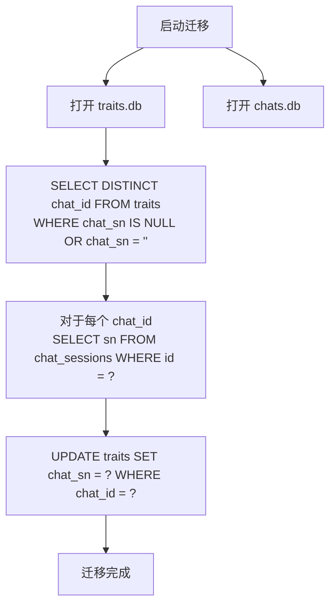
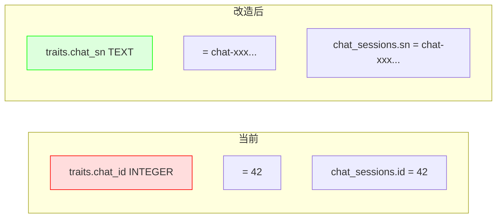

# Traits ↔ Chats 关联方式分析：整数 chat_id vs 全局 chat_sn

## 一、当前架构概览

### 两个独立的 SQLite 数据库

| 数据库 | 路径模式 | 核心表 |
|--------|----------|--------|
| **chats 库** | `localdb/{userNo}.chats.db` | `chat_sessions(id INTEGER PK, sn TEXT UNIQUE, ...)` |
| **traits 库 (brain)** | `localdb/{userNo}.traits.db` | `traits(id, chat_id INTEGER, ...)` |

### 当前关联方式

```
traits.chat_id (INTEGER)  →  chat_sessions.id (INTEGER PK)
```

两个数据库位于**同一用户目录**下，`chat_sessions.id` 是 SQLite 自增主键，在同一用户的 chats 库内唯一。

### 消息表的关联方式（作为对比）

`chat_messages.chat_id` 和 `web_sources.chat_id` 也在 `chats.db` 内部用 INTEGER 关联 `chat_sessions.id` —— 但它们在**同一个数据库文件内**，有 FK 约束，这是合理的。

---

## 二、当前 traits 使用 chat_id 的所有代码路径

### 2.1 写入路径（[`on_traits.go`](../internal/local/agent/on_traits.go:365)）

```go
// line 365
h.storeTraitsInSession(r.Context(), session, remoteResp.Features, foundChat.ID)
//                                          foundChat.ID = chat_sessions.id  ↑
```

### 2.2 存储函数（[`on_traits.go:406`](../internal/local/agent/on_traits.go:406)）

```go
func (h *ChatAgent) storeTraitsInSession(ctx context.Context, session *session, features []traitsFeature, chatID int64) error {
    // ...
    trait := &store.PersonalTrait{
        ChatID: chatID,  // ← 存的是 chat_sessions.id
    }
    traitID, err := vs.AddTrait(ctx, trait, vector)
}
```

### 2.3 数据模型（[`traits.go:22`](../internal/local/store/traits.go:22)）

```go
type PersonalTrait struct {
    ChatID  int64  `db:"chat_id"`    // 来源 chat ID (chat_sessions.id)
}
```

### 2.4 增量提取查询（[`on_traits.go:275`](../internal/local/agent/on_traits.go:275)）

```go
existingTraits, listErr := vs.ListTraitsByChat(foundChat.ID)
//                                          foundChat.ID = chat_sessions.id
```

### 2.5 DB 查询（[`traits.go:385`](../internal/local/store/traits.go:385)）

```go
func (s *VectorStore) ListTraitsByChat(chatID int64) ([]PersonalTrait, error) {
    rows, err := s.db.Query(
        `SELECT ... FROM traits WHERE chat_id = ? ORDER BY create_at DESC`,
        chatID,
    )
}
```

### 2.6 数据库 schema（[`traits.go:97`](../internal/local/store/traits.go:97)）

```go
CREATE TABLE IF NOT EXISTS traits (
    chat_id    INTEGER NOT NULL DEFAULT 0,
    ...
);
CREATE INDEX IF NOT EXISTS idx_traits_chat_id ON traits(chat_id);
```

---

## 三、改造为 chat_sn 的影响范围分析

### 3.1 需要修改的文件

| 文件 | 修改内容 | 影响程度 |
|------|----------|----------|
| [`internal/local/store/traits.go`](../internal/local/store/traits.go:28) | `PersonalTrait.ChatID` → `ChatSN string`；schema 中 `chat_id` 改为 `chat_sn TEXT`；`ListTraitsByChat` 签名变更 | **中等** |
| [`internal/local/agent/on_traits.go`](../internal/local/agent/on_traits.go:275) | `ListTraitsByChat(foundChat.ID)` → `ListTraitsByChat(foundChat.SN)`；`storeTraitsInSession` 第二个参数从 `chatID int64` 改为 `chatSN string` | **小** |
| 索引维护 | `idx_traits_chat_id` → `idx_traits_chat_sn` | 微小 |

### 3.2 不需要修改的文件

| 文件 | 原因 |
|------|------|
| [`internal/local/store/chats.go`](../internal/local/store/chats.go) | chats 库内部关联不变（`chat_messages.chat_id`、`web_sources.chat_id` 仍用 `chat_sessions.id`，在同一个 DB 文件内没问题） |
| [`internal/local/agent/db.go`](../internal/local/agent/db.go) | `persistMessageToDB` 等仍用 `chatID`，不受影响 |
| [`internal/local/store/messages.go`](../internal/local/store/messages.go) | messages 库内部关联不变 |
| 前端代码 | 前端发 traits 请求时已经是传 `{"sn": "xxx"}`，不受影响 |
| Remote-server | remote-server 只处理 LLM 调用，不直接操作 traits DB |

### 3.3 数据迁移需求

已有数据中有 `chat_id` 的值，但无法简单地直接转为 `sn`，因为：
- `traits.db` 和 `chats.db` 是**两个独立文件**
- SQLite 不支持跨库 JOIN

解决方案：在应用层做**一次性的迁移**——启动时遍历所有 traits，根据 `chat_id` 回查出 `sn`。



---

## 四、利弊分析

### 4.1 改 `sn` 的好处 ✅

| # | 优势 | 说明 |
|---|------|------|
| 1 | **跨库全局唯一** | SN 是 UUID v4 格式，不依赖任何数据库的自增序列，traits.db 独立可迁移 |
| 2 | **与 API 层对齐** | 前端→后端所有通信已用 `sn`，traits 请求也是传 `sn`，存储层对齐后全链路一致 |
| 3 | **数据可移植性** | traits.db 可独立复制、备份、恢复，不依赖 chats.db 的 id 映射 |
| 4 | **Debug 友好** | 看到 trait 记录直接知道属于哪个 chat（`chat-xxx...`），无需跨库查询 |
| 5 | **未来扩展** | 支持跨用户引用（如"把用户 A 在 chat-X 中学到的 traits 迁移到用户 B"）、数据导出、匿名→登录合并等场景 |
| 6 | **chats.db 重建鲁棒性** | 如果 chats.db 损坏重建，新的自增 id 从 1 开始，会导致 traits 关联错乱；用 sn 则不受影响 |

### 4.2 不改（保持 `chat_id`）的好处 ✅

| # | 优势 | 说明 |
|---|------|------|
| 1 | **零改动** | 当前功能完全正常运行 |
| 2 | **存储更小** | INTEGER (8 bytes) vs TEXT (~40 bytes) |
| 3 | **查询更快** | INTEGER 索引比 TEXT 索引略快（差异很小，SQLite 级别可忽略） |

### 4.3 风险与成本

| 维度 | 评估 |
|------|------|
| 修改代码量 | ~3 个文件，约 50 行 |
| 数据迁移 | 需要一次性迁移脚本，但数据量很小（每人几百条 traits） |
| 兼容性 | 如果用户有存量数据，迁移后旧 `chat_id` 列可先保留再删除 |
| 影响面 | 仅 traits 相关功能，不影响 chat、message、web_source 等 |

---

## 五、建议

**建议改。** 理由如下：

1. **现在已经有了全局唯一的 `sn`，但 traits 层没用它**，这是一个设计上的不一致
2. **未来可能性很多**（数据导出、跨用户分析、匿名→登录 traits 合并），用整数 id 会变成瓶颈
3. **修改成本很低**，只涉及 traits 这一个表，不会牵一发动全身
4. **现在是改的好时机**——traits 功能刚实现不久，存量数据少，迁移成本最小

### 具体方案



### 实施步骤

1. **添加 `chat_sn` 列**（双写兼容期）
2. **数据迁移**：遍历已有 traits，从 chats.db 回填 `chat_sn`
3. **代码修改**：`PersonalTrait.ChatID` → `ChatSN`，`ListTraitsByChat` 查 `chat_sn`
4. **删除旧列+索引**（可选，数据稳定后）：`DROP INDEX idx_traits_chat_id`，`DROP COLUMN chat_id`
