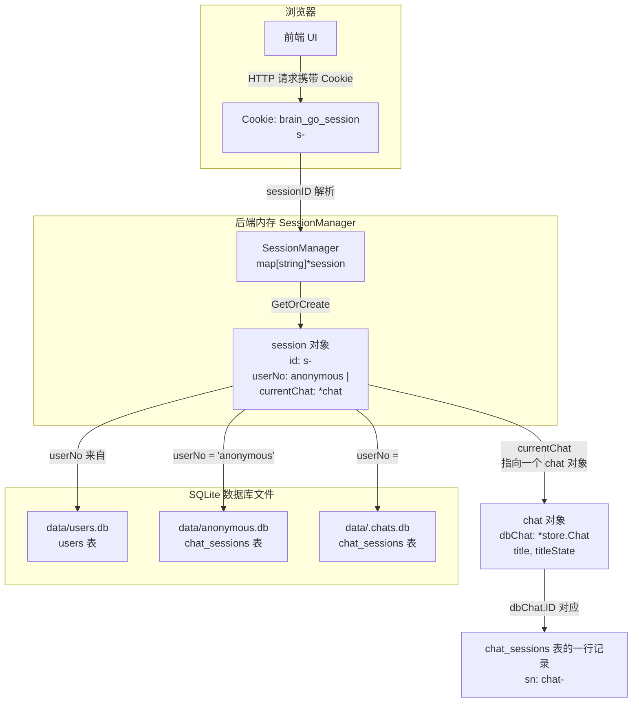

# 用户、HTTP-Session（Cookie）、Chat-Session 关系分析

## 1. 三个概念的定义

| 概念 | 代码位置 | 定义 |
|------|---------|------|
| **用户（User）** | [`internal/store/users.go:21`](../../internal/store/users.go#L21) | 存储在 `data/users.db` 的 `users` 表，每个用户有唯一 `uuid`（32字符）和 `user_no`（即 `uuid`）。通过 `POST /api/chat/login` 传入 `user_no` 来"登录"。 |
| **HTTP-Session（Cookie）** | [`internal/agent/session.go:34`](../../internal/agent/session.go#L34) | 浏览器 Cookie，名称为 `brain_go_session`，值为 `s-<uuid-v4>` 格式的 sessionID。由后端在第一次请求时生成并写入 `HttpOnly` Cookie，有效期 7 天。 |
| **Chat-Session（对话）** | [`internal/store/chats.go:21`](../../internal/store/chats.go#L21) | 存储在 `data/<user_no>.chats.db` 或 `data/anonymous.db` 的 `chat_sessions` 表中的记录，每个记录有唯一 `sn`（`chat-<uuid-v4>` 格式）。一个 Chat-Session 对应一次"对话"（包含多条消息）。 |

## 2. 关系图



## 3. 关系本质：N : 1 : N

```
一个用户 (User)  ──── 可以有多个 HTTP-Session (Cookie)
                          │
                          │  每个 HTTP-Session 在内存中对应一个 session 对象
                          │
                          ├── 可以有多个 Chat-Session（对话列表）
                          │
                          └── 同一时刻只有一个 currentChat（当前活跃对话）
```

### ① 用户 ↔ HTTP-Session：1 : N

- 用户通过 `POST /api/chat/login` 传入 `user_no`，调用 [`session.switchToUser(sn)`](../../internal/agent/types.go#L135) 将内存中 `session.userNo` 从 `"anonymous"` 改为用户的 `uuid`。
- 同一个用户可以在不同浏览器、不同设备上登录，每个浏览器有自己独立的 Cookie（不同的 `sessionID`），因此会有多个 `session` 对象指向同一个 `userNo`。
- **没有持久化的"登录态"**——每次页面刷新后，前端通过 `localStorage` 中保存的 `user_no` 重新调用 `POST /api/chat/login` 来恢复登录状态。

### ② HTTP-Session ↔ Chat-Session：1 : N

- 每个 `session` 对象在内存中维护一个 [`chats []store.Chat`](../../internal/agent/types.go#L108) 列表，这是该用户（或匿名用户）的所有对话。
- 同一时刻只有一个 [`currentChat *chat`](../../internal/agent/types.go#L107) 是"当前活跃对话"。
- 前端可以通过 `POST /api/session/new` 创建新对话（重置 `currentChat`），或通过 `POST /api/chat/switch?sn=XXX` 切换到历史对话。

### ③ 用户 ↔ Chat-Session：1 : N

- 登录用户的对话存储在 `data/<uuid>.chats.db` 文件中。
- 匿名用户的对话存储在 `data/anonymous.db` 文件中。
- 匿名用户登录后，**不会迁移匿名对话**——匿名对话保留在 `anonymous.db` 中，登录后打开的是用户自己的 `chats.db`。

## 4. 关键代码路径

| 场景 | 流程 |
|------|------|
| **首次访问（匿名）** | 浏览器无 Cookie → [`getSessionID()`](../../internal/agent/session.go#L34) 生成新 `s-<uuid>` → 写入 Cookie → [`GetOrCreate()`](../../internal/agent/types.go#L212) 创建 `session{userNo: "anonymous", chatStore: anonymousStore}` |
| **匿名用户发消息** | [`OnNewMessage()`](../../internal/agent/on_chat.go#L172) → `resolveSessionID()` 从 Cookie 取 sessionID → `GetOrCreate()` 获取 session → `appendNewRequestMessage()` → `ensureDBSession()` 在 `anonymous.db` 创建 `chat_sessions` 记录 |
| **用户登录** | `POST /api/chat/login` → [`OnLogin()`](../../internal/agent/on_login.go#L20) → `resolveSessionID()` 取 Cookie → `session.switchToUser(userNo)` → 打开 `data/<uuid>.chats.db` → 加载该用户的对话列表 |
| **登录后发消息** | 同上，但 `session.chatStore` 已切换为用户自己的 DB，`session.userNo` 为用户的 `uuid` |
| **页面刷新后恢复** | `GET /api/session` → [`OnRestoreSession()`](../../internal/agent/on_session.go#L18) → Cookie 仍在 → `GetMessages()` 从 DB 加载消息 → 前端从 `localStorage` 取 `user_no` 重新调用登录 |

## 5. 总结

**不是 1:1:1 的关系，而是：**

```
User : HTTP-Session : Chat-Session = 1 : N : N
```

- **1 个用户**可以拥有 **N 个 HTTP-Session**（多设备/多浏览器）
- **1 个 HTTP-Session**（对应 1 个内存 `session` 对象）可以拥有 **N 个 Chat-Session**（对话列表）
- **1 个 HTTP-Session** 同一时刻只有 **1 个 currentChat**（当前活跃对话）
- **匿名用户**（`userNo = "anonymous"`）本质上也是一个"用户"，只是没有持久化的用户记录
