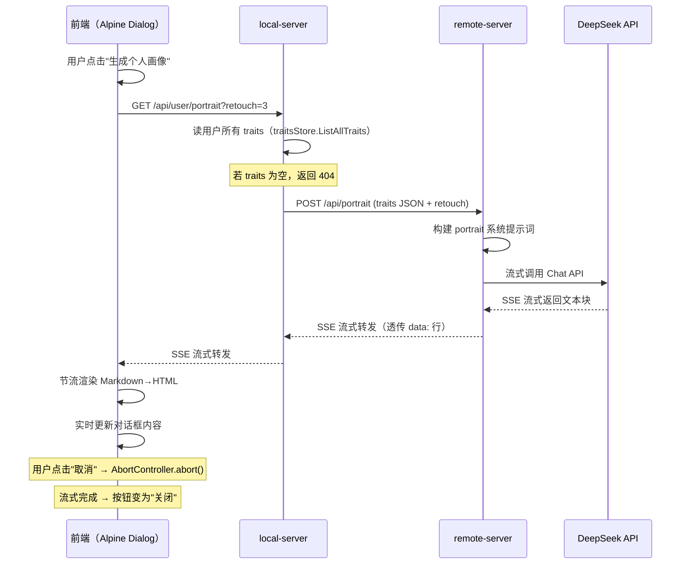

# 用户画像（User Portrait）生成功能实现计划

## 1. 整体架构

```
┌─────────────────────┐     SSE Stream     ┌──────────────────────┐     SSE Stream     ┌──────────────────────┐
│     前端 (Alpine)    │ ◄──────────────── │    local-server      │ ◄──────────────── │    remote-server     │
│  UserPortraitDialog  │                   │  GET /api/user/      │                   │  POST /api/portrait   │
│                      │   retouch=3       │  portrait?retouch=3  │                   │                      │
│  1. 打开对话框       │ ────────────────► │                      │   traits JSON     │  流式调用 LLM        │
│  2. 发起 GET 请求    │                   │  1. 读 traits DB     │ ────────────────► │  生成画像文本        │
│  3. SSE 流式渲染     │                   │  2. 转发到 remote    │                   │                      │
│  4. "取消"/"关闭"    │                   │  3. SSE 代理回前端   │                   │                      │
└─────────────────────┘                    └──────────────────────┘                   └──────────────────────┘
```

## 2. 数据流详解

### 请求链路
```
前端 GET /api/user/portrait?retouch=3
  └─► local-server: sessionManager → 获取 traitsStore
      ├─► traitsStore.ListAllTraits()  ← 读出所有 PersonalTrait（含 create_at 等字段）
      └─► POST http://remote-server:8088/api/portrait
          ├─ Body: { "lang": "zh-CN", "retouch": 3, "traits": [...] }
          ├─ SSE 流式响应 ← remote-server 流式调用 LLM
          └─► local-server SSE 代理写回前端
```

### SSE 事件定义（复用现有格式）
在现有 SSE 事件格式基础上扩展：
- `data: {"event":"text", "data":"..."}` → 流式文本块
- `data: {"event":"error", "data":"错误信息"}`
- `data: {"event":"done", "data":{}}` → 完成信号

## 3. 分步实现细节

---

### Step 1: VectorStore 添加 listAllTraits()

**文件**: [`internal/local/store/traits.go`](internal/local/store/traits.go)

在 `VectorStore` 结构体上新增方法（参照现有的 `ListTraitsByChat` 模式）：

```go
// ListAllTraits 返回该用户所有个人特征条目，按 create_at 降序排列。
func (s *VectorStore) ListAllTraits() ([]PersonalTrait, error) {
    rows, err := s.db.Query(
        `SELECT id, trait, category, confidence, half_life, chat_sn, create_at, update_at
         FROM traits ORDER BY create_at DESC`)
    // ... 扫描并返回
}
```

---

### Step 2: 系统提示词添加 [portrait] 节

**文件**: [`lang/remote/zh-CN/system_prompt.toml`](lang/remote/zh-CN/system_prompt.toml)

```toml
[portrait]
other = """
你是一个**用户个人画像生成助手**。根据用户的所有个人特征条目，生成一段自然流畅、有温度的个人画像描述。

**核心要求**：
1. 本质是一段对用户（第二人称）的沟通式描述，像 AI 在与你谈心：以"你"开头，用"我发现"、"我注意到"、"我想"等口吻。
2. 是对多条个人特征的更高层面抽象、归纳，而非流水账罗列。
3. 不同方面的描述独立成段，避免一大段文字，必要时可用条目、表格、图标等强化展现效果。

**润色级别（retouch={{.Retouch}}）**：取值 0~5
- 0：完全客观描述，优缺点直言不讳。
- 5：几乎完全不提及用户缺点，即使提到也极其委婉。
- 1~4：介于两者之间，数字越大越委婉。

**输入数据结构**：每条特征包含 trait（文本）、category（分类）、confidence（置信度 1-10）、half_life（半衰期 1-4）、create_at（生成时间）。

**格式要求**：
- 使用 Markdown 格式输出。
- 语言简洁自然，避免官方腔。
- 使用第二人称"你"，风格亲切但不轻浮。

以下为用户的所有个人特征条目（JSON格式）：
{{.TraitsJSON}}

请基于以上特征，生成用户的个人画像。
"""
```

> 注意：i18n 系统的 `loadWithPrefix` 会将子目录文件中的 message ID 自动加上文件名前缀，所以 `[portrait]` 注册后的 ID 是 `system_prompt-portrait`。取用时用 `i18n.SystemPrompt.TL("zh-CN", "portrait", data)`。

---

### Step 3: Remote Server 添加流式画像 handler

**新建文件**: [`internal/remote/agent/on_portrait.go`](internal/remote/agent/on_portrait.go)

#### 请求体结构
```go
type portraitRequest struct {
    Lang    string               `json:"lang"`    // e.g. "zh-CN"
    Retouch int                  `json:"retouch"` // 0-5
    Traits  []portraitTraitItem `json:"traits"`   // 用户所有特征
}
type portraitTraitItem struct {
    Text       string `json:"text"`
    Category   int    `json:"category"`
    Confidence int    `json:"confidence"`
    HalfLife   int    `json:"half_life"`
    CreateAt   string `json:"create_at"`
}
```

#### Handler 逻辑
1. 接收 POST 请求，解析 `portraitRequest`
2. 构建系统提示词：从 `lang/remote/{lang}/system_prompt.toml` 读 `portrait` 节，注入 `Retouch` 和 `TraitsJSON`
3. 创建 DeepSeek 客户端
4. 调用 `client.ChatStream()`（流式）
5. 使用 `sse.Writer` 流式写回响应

**路由注册**: [`cmd/remote-server/main.go`](cmd/remote-server/main.go) 添加：
```go
srv.POST("/api/portrait", agent.OnPortrait)
```

---

### Step 4: Local Server 添加 GET /api/user/portrait handler

**新建文件**: [`internal/local/agent/on_portrait.go`](internal/local/agent/on_portrait.go)

#### Handler 逻辑 (`OnGetUserPortrait`)
1. 解析 query 参数 `retouch`（默认 3，范围 0-5）
2. 从 cookie 中解析 sessionID，获取 session
3. 通过 `session.traitsStore.ListAllTraits()` 读取该用户所有特征
4. **如果 traits 为空**：返回 404 或友好提示
5. 调用 remote-server 的 `POST /api/portrait`（SSE 流式）
6. 将 remote-server 的 SSE 流代理写回前端的 ResponseWriter

**路由注册**: [`cmd/server/main.go`](cmd/server/main.go) 添加：
```go
srv.GET("/api/user/portrait", chatHandler.OnGetUserPortrait)
```

> **关于 SSE 代理**：Local Server 需要建立到 Remote Server 的 HTTP 连接，读取其 SSE 流，然后将每个 `data:` 事件原样转发给前端。可参考 [`infra/httpx/sse/reader.go`](infra/httpx/sse/reader.go) 的 `Reader` 来读取远程 SSE 流。

---

### Step 5: 前端对话框组件

**新建文件**:
- [`frontend/static/dialogs/portrait-dialog.css`](frontend/static/dialogs/portrait-dialog.css)
- [`frontend/static/dialogs/portrait-dialog.js`](frontend/static/dialogs/portrait-dialog.js)

#### CSS (`portrait-dialog.css`)
- 遮罩层：全屏半透明黑，`z-index: 1080`（高于普通对话框）
- 对话框容器：宽度 ~600px，圆角，阴影
- 左上：用户头像（圆形，48px = 2x 主页面头像大小）
- 标题："XXX 个人画像"
- 内容区：可滚动，自动换行
- 右上：复制按钮（带下拉菜单）+ 分享按钮
- 底部靠右：取消（红色）/ 关闭按钮

#### JavaScript (`portrait-dialog.js`)
使用 Alpine.data 注册 `userPortraitDialog` 组件：

```javascript
Alpine.data('userPortraitDialog', () => ({
    show: false,
    portrait: '',         // 完整画像 Markdown 文本
    portraitHTML: '',     // 渲染后的 HTML
    isStreaming: false,   // 是否正在流式接收
    isDone: false,        // 是否已完成
    userName: '',         // 用户昵称
    userAvatar: '',       // 用户头像 URL
    error: null,          // 错误信息

    // AbortController，用于取消流
    abortController: null,

    open() {
        // 1. 设置用户信息
        this.userName = ...;
        this.userAvatar = ...;
        this.show = true;

        // 2. 发起 GET /api/user/portrait?retouch=3
        // 3. SSE 流式读取，累加到 this.portrait
        // 4. 节流渲染 Markdown → HTML
    },

    close() {
        // 关闭对话框，中止 SSE 流
        this.show = false;
        if (this.abortController) this.abortController.abort();
    },

    cancel() {
        // 流式未完成时中止
        if (this.abortController) this.abortController.abort();
        this.show = false;
    },

    // 复制相关
    copyAsPlain() { ... },
    copyAsMarkdown() { ... },
    copyAsHTML() { ... },

    // 分享（暂不实现）
    share() { showToast('分享功能即将上线', 'info'); },
}));
```

#### HTML 模板（集成到 [`frontend/index.html`](frontend/index.html)）
在 `<body>` 末尾添加对话框模板。复用现有的 `dialog-overlay` 和 `dialog-box` 类。

---

### Step 6: 复制按钮实现

**利用现成的复制功能**：项目中已有 [`frontend/static/chat-copy.js`](frontend/static/chat-copy.js) 和 [`frontend/static/clipboard.js`](frontend/static/clipboard.js)，提供了 `copyPlainText`、`copyMarkdown`、`copyHtml` 等工具函数。

对话框的复制按钮逻辑：
- 按钮标题为 "复制"
- 点击后弹出下拉菜单，三项：复制为纯文本、复制为 Markdown、复制为 HTML
- 使用 `showDropdownMenu` 函数（已在 `chat-copy.js` 中实现）或独立实现简单的菜单

**分享按钮**：与复制按钮平级，点击后显示 Toast "分享功能即将上线"。

---

### Step 7: 底部按钮状态管理

- **流式未完成时**：底部靠右显示红色 "取消" 按钮
  - 点击：调用 `abortController.abort()` 中止 SSE 流，关闭对话框
- **流式完成后**：底部靠右显示 "关闭" 按钮（正常样式）
  - 点击：关闭对话框

使用 Alpine 的 `x-show` 根据 `isStreaming` 和 `isDone` 切换显示。

---

### Step 8: onOpenUserTraits 更新

**文件**: [`frontend/static/chat-api.js`](frontend/static/chat-api.js)

将现有的占位实现替换为实际逻辑：

```javascript
window.onOpenUserTraits = function() {
    try {
        var dialog = document.querySelector('[x-data="userPortraitDialog"]');
        if (dialog && dialog.__x) {
            dialog.__x.$data.open();
        }
    } catch(e) {
        console.error('打开用户画像对话框失败:', e);
    }
};
```

或者通过 Alpine store 暴露方法，让 HTML 模板中的 `@click` 直接调用。

---

## 4. 需要修改/新建的文件汇总

| # | 文件 | 操作 | 说明 |
|---|------|------|------|
| 1 | [`internal/local/store/traits.go`](internal/local/store/traits.go) | 修改 | 添加 `ListAllTraits()` 方法 |
| 2 | [`lang/remote/zh-CN/system_prompt.toml`](lang/remote/zh-CN/system_prompt.toml) | 修改 | 添加 `[portrait]` 节 |
| 3 | [`internal/remote/agent/on_portrait.go`](internal/remote/agent/on_portrait.go) | **新建** | 远程画像 handler（流式） |
| 4 | [`cmd/remote-server/main.go`](cmd/remote-server/main.go) | 修改 | 注册 `POST /api/portrait` 路由 |
| 5 | [`internal/local/agent/on_portrait.go`](internal/local/agent/on_portrait.go) | **新建** | 本地画像 handler（读 DB + SSE 代理） |
| 6 | [`cmd/server/main.go`](cmd/server/main.go) | 修改 | 注册 `GET /api/user/portrait` 路由 |
| 7 | [`frontend/static/dialogs/portrait-dialog.css`](frontend/static/dialogs/portrait-dialog.css) | **新建** | 对话框样式 |
| 8 | [`frontend/static/dialogs/portrait-dialog.js`](frontend/static/dialogs/portrait-dialog.js) | **新建** | 对话框 Alpine 组件 |
| 9 | [`frontend/index.html`](frontend/index.html) | 修改 | 引入 CSS/JS、添加对话框模板 |
| 10 | [`frontend/static/chat-api.js`](frontend/static/chat-api.js) | 修改 | 更新 `onOpenUserTraits` 实现 |

## 5. 关键设计决策

### 5.1 SSE 代理策略
Local Server 作为中间层，不解析 SSE 事件内容，直接透传 Remote Server 的 SSE `data:` 行。这样 Remote Server 可以独立定义事件格式，Local Server 只负责转发。

### 5.2 错误处理
- **Traits 为空**：Local Server 返回 404，前端对话框显示"暂无个人特征数据，请先进行对话和特征提取"。
- **Remote Server 不可达**：Local Server 返回 502，前端显示"画像服务暂时不可用"。
- **流式中断**：前端显示已接收的部分内容 + "（生成中断）"提示。

### 5.3 安全性
- `GET /api/user/portrait` 从 cookie 鉴权（使用现有的 `resolveSessionID`），与现有 API 一致。
- Retouch 参数范围限定 0-5，超出则默认使用 3。

### 5.4 Markdown 渲染
对话框内容使用现有的 `chat-markdown.js` 中的 `renderMarkdown` 函数进行渲染，保持与主聊天界面一致的 Markdown 风格。

---

## 6. 流程图



---

## 7. 后续可扩展点

- 分享功能：生成分享链接或图片
- 画像历史：保存每次生成的画像，支持历史对比
- 画像导出：支持 PDF/图片导出
- 多语言支持：为 [portrait] 系统提示词添加英文版本
