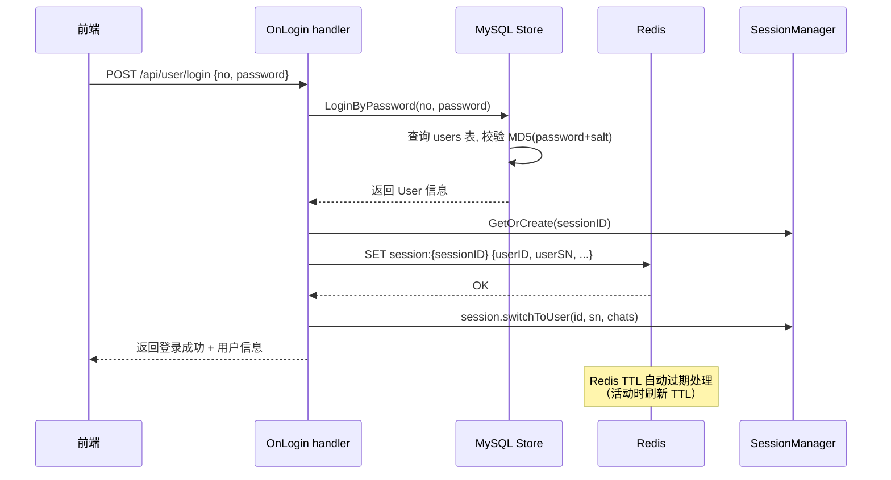
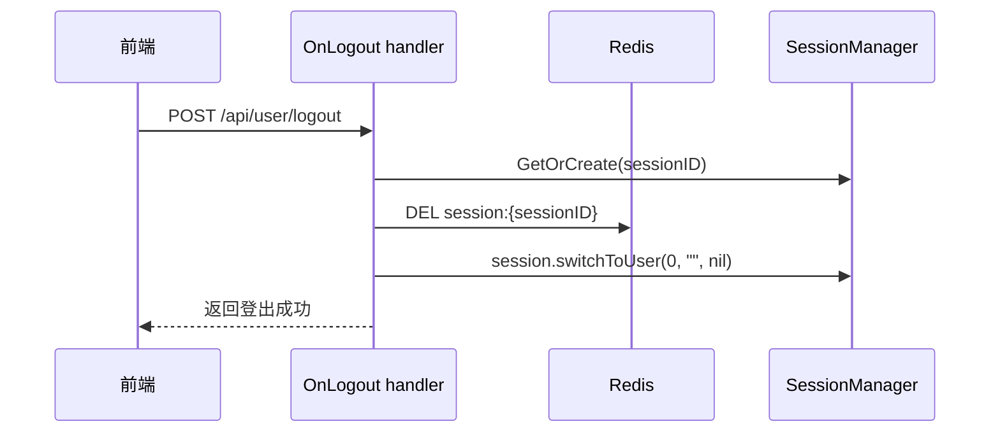

# User 表迁移 MySQL + Session 引入 Redis 计划

> 最后更新: 2026-07-06

---

## 一、现状分析

### 1.1 当前用户存储架构

```
┌──────────────────────────────────────────────┐
│            UserStore (SQLite)                  │
│  internal/store/users.go                      │
│  internal/store/the_user_store.go             │
│                                                │
│  驱动: github.com/mattn/go-sqlite3 (CGO)      │
│  框架: github.com/jmoiron/sqlx                 │
│  文件: localdb/users.db                        │
│  生命周期: 启动时打开, 关闭时关闭              │
│  访问: store.TheUserStore() 全局单例           │
└──────────────────────────────────────────────┘
```

### 1.2 当前会话管理架构

```
┌──────────────────────────────────────────────┐
│       SessionManager (纯内存, Go map)          │
│  internal/agent/session_mgr.go                │
│  internal/agent/session.go                    │
│                                                │
│  结构: map[string]*session                     │
│  session 数据: id, user.ID, user.SN,           │
│               chats, currentChat, lastActivity  │
│  持久化: 无 — 服务器重启后所有会话丢失          │
│  水平扩展: 不支持 — session 在单机内存中        │
└──────────────────────────────────────────────┘
```

### 1.3 用户表当前 Schema (SQLite DDL)

```sql
CREATE TABLE IF NOT EXISTS users (
    id        INTEGER PRIMARY KEY AUTOINCREMENT,
    no        TEXT    NOT NULL CHECK(length(no) = 6),
    sn        TEXT    NOT NULL CHECK(length(sn) <= 58),
    tel       TEXT    NOT NULL DEFAULT '' CHECK(length(tel) <= 18),
    nickname  TEXT    NOT NULL CHECK(length(nickname) <= 38),
    password  TEXT    NOT NULL,
    salt      TEXT    NOT NULL CHECK(length(salt) = 32),
    deleted   INTEGER NOT NULL DEFAULT 0,
    create_at DATETIME NOT NULL DEFAULT CURRENT_TIMESTAMP,
    update_at DATETIME NOT NULL DEFAULT CURRENT_TIMESTAMP
);
CREATE UNIQUE INDEX idx_users_no ON users(no);
CREATE UNIQUE INDEX idx_users_sn ON users(sn);
```

---

## 二、目标架构

### 2.1 整体架构图

```mermaid
flowchart TD
    subgraph "启动初始化"
        A[main.go] --> B[InitMySQLStore]
        A --> C[InitRedisClient]
        A --> D[InitAgent/InitDBConfig]
    end

    subgraph "用户存储 MySQL"
        B --> E[MySQLStore]
        E --> F[(MySQL brain_forever)]
        F --> G[users 表]
        F --> H[future: payments, etc.]
    end

    subgraph "会话管理 Redis"
        C --> I[RedisClient]
        I --> J[(Redis)]
        J --> K[登录态: session:{sid}]
        J --> L[session GC 通过 TTL]
    end

    subgraph "业务数据 SQLite（保持不变）"
        D --> M[dbc.InitDBConfig]
        M --> N["*.chats.db / *.brain.db"]
    end

    subgraph "API 层"
        O[OnLogin] -->|验证密码| E
        O -->|写入登录态| I
        P[OnLogout] -->|清除登录态| I
        Q[其他 Handler] -->|验证 session| I
        Q -->|读写业务数据| M
    end
```

### 2.2 数据流变更

#### 登录流程（变更后）



#### 登出流程（变更后）



---

## 三、MySQL 用户表 DDL

```sql
-- ============================================================
-- 数据库：brain_forever (需预先创建)
-- CREATE DATABASE IF NOT EXISTS brain_forever
--   DEFAULT CHARACTER SET utf8mb4
--   DEFAULT COLLATE utf8mb4_unicode_ci;
-- ============================================================

-- ============================================================
-- 用户表
-- 替代 SQLite 的 localdb/users.db 中的 users 表
-- ============================================================
CREATE TABLE IF NOT EXISTS `users` (
    `id`         BIGINT UNSIGNED NOT NULL AUTO_INCREMENT  COMMENT '自增主键',
    `no`         VARCHAR(6)      NOT NULL                 COMMENT '6位用户编号（1字母+5数字）',
    `sn`         VARCHAR(58)     NOT NULL                 COMMENT '用户序列号，如 u-xxx-xxx',
    `tel`        VARCHAR(18)     NOT NULL DEFAULT ''       COMMENT '手机号，空=未验证',
    `nickname`   VARCHAR(38)     NOT NULL                 COMMENT '默认昵称',
    `password`   VARCHAR(255)    NOT NULL                 COMMENT '密码: MD5(rawPassword + salt)',
    `salt`       CHAR(32)        NOT NULL                 COMMENT '密码盐值（16字节随机 -> 32 hex）',
    `deleted`    TINYINT(1)      NOT NULL DEFAULT 0        COMMENT '软删除: 0=正常, 1=已删除',
    `create_at`  DATETIME        NOT NULL DEFAULT CURRENT_TIMESTAMP COMMENT '创建时间',
    `update_at`  DATETIME        NOT NULL DEFAULT CURRENT_TIMESTAMP ON UPDATE CURRENT_TIMESTAMP COMMENT '更新时间',
    PRIMARY KEY (`id`),
    UNIQUE KEY `uk_no`  (`no`),
    UNIQUE KEY `uk_sn`  (`sn`)
) ENGINE=InnoDB DEFAULT CHARSET=utf8mb4 COLLATE=utf8mb4_unicode_ci
  COMMENT='用户账户表';
```

### 关键设计说明

| 项目 | SQLite 旧版 | MySQL 新版 | 原因 |
|------|-------------|-----------|------|
| `id` | `INTEGER AUTOINCREMENT` | `BIGINT UNSIGNED AUTO_INCREMENT` | 未来用户量大时 int 可能不够 |
| `no` | `TEXT CHECK(length=6)` | `VARCHAR(6)` | MySQL 用 VARCHAR 更高效 |
| `sn` | `TEXT CHECK(length<=58)` | `VARCHAR(58)` | 同上 |
| `tel` | `TEXT CHECK(length<=18)` | `VARCHAR(18)` | 同上 |
| `nickname` | `TEXT CHECK(length<=38)` | `VARCHAR(38)` | 同上 |
| `password` | `TEXT` | `VARCHAR(255)` | MD5 输出 32 hex，为将来升级预留空间 |
| `salt` | `TEXT CHECK(length=32)` | `CHAR(32)` | 定长字段，CHAR 更高效 |
| `deleted` | `INTEGER DEFAULT 0` | `TINYINT(1) DEFAULT 0` | MySQL 布尔习惯 |
| `update_at` | Trigger 实现自动更新 | `ON UPDATE CURRENT_TIMESTAMP` | MySQL 原生支持，无需 Trigger |
| 字符集 | SQLite TEXT (UTF-8) | `utf8mb4 / utf8mb4_unicode_ci` | 支持完整 Unicode，包括 emoji |
| 引擎 | — | `InnoDB` | 支持事务、行级锁，适合支付等场景 |

---

## 四、Redis Session 数据设计

### 4.1 Redis Key 命名规范

| Key 模式 | 用途 | TTL |
|----------|------|-----|
| `session:{sessionID}` | Hash: 存储用户登录态 | 7 天（活跃时刷新） |

### 4.2 Session Hash 字段

```
Key:    session:s-xxxxxxxx-xxxx-4xxx-yxxx-xxxxxxxxxxxx
Type:   HASH
TTL:    604800  (7 天, 同 cookie MaxAge)

Fields:
  user_id      → "42"           (用户数据库 ID)
  user_sn      → "u-xxx-xxx"    (用户序列号)
  created_at   → "2026-07-06T14:30:00+08:00"  (会话创建时间)
  last_active  → "2026-07-06T14:35:00+08:00"  (最后活跃时间)
```

### 4.3 与内存 Session 的协同策略

当前 `session` 结构体除了登录态还有 `chats`、`currentChat` 等业务状态（对话列表、当前活跃对话等）。这些业务状态**不需要**持久化到 Redis，原因：

1. `chats`（对话列表）：每次请求时从 SQLite 按需加载（已通过 `dbc.OpenLocalChatDB` 实现）
2. `currentChat`：前端每次请求时通过 `GET /api/chat/switch?sn=xxx` 切换，不需要持久化
3. `chatsMu` / `mu` 等互斥锁：只在当前进程有效

**因此，Redis 只存储登录态的核心标识（user_id, user_sn），session 的内存结构依然保留，但初始化时从 Redis 恢复 user_id/user_sn。**

```
session 结构体变化:
  - 保留: id, user.ID, user.SN, chats, currentChat, mu, chatsMu
  - 新增: 初始化时先查 Redis，有登录态则恢复 user.ID + user.SN
  - 登录时: Redis SET + 内存 switchToUser
  - 登出时: Redis DEL + 内存 switchToUser(0, "", nil)
```

### 4.4 Session 恢复流程

```mermaid
flowchart TD
    A[收到请求] --> B[从 Cookie 获取 sessionID]
    B --> C{SessionManager 中<br/>有对应 session?}
    C -->|有| D[刷新 lastActivity → OK]
    C -->|无| E[检查 Redis: EXISTS session:{sid}]
    E -->|存在| F[创建 session<br/>从 Redis 恢复 user_id, user_sn]
    E -->|不存在| G[创建匿名 session (ID=0, SN="")]
    F --> H[继续处理请求]
    G --> H
```

---

## 五、实施步骤

### 第 1 步：MySQL 建表 DDL

- 执行上述 DDL 创建 `users` 表
- 可创建 SQL 脚本 `deploy/migrations/001_create_users_table.sql`

### 第 2 步：添加 Go 依赖

- **MySQL 驱动**: `github.com/go-sql-driver/mysql v1.8.x`
- **Redis 客户端**: `github.com/redis/go-redis/v9 v9.x`
- sqlx 保持不变（天然支持 MySQL）

### 第 3 步：新增配置项

**文件**: [`internal/config/config.go`](internal/config/config.go)

新增 `DatabaseConfig` 和 `RedisConfig`：

```go
// DatabaseConfig MySQL 数据库配置
type DatabaseConfig struct {
    DSN          string // e.g. "user:pass@tcp(127.0.0.1:3306)/brain_forever?charset=utf8mb4&parseTime=true"
    MaxOpenConns int    // 默认 25
    MaxIdleConns int    // 默认 5
}

// RedisConfig Redis 配置
type RedisConfig struct {
    Addr     string // e.g. "127.0.0.1:6379"
    Password string
    DB       int    // 默认 0
    PoolSize int    // 默认 10
}
```

在 `Config` 结构体中添加：
```go
Database DatabaseConfig
Redis    RedisConfig
```

### 第 4 步：创建 MySQL UserStore

**新文件**: [`internal/store/mysql_user_store.go`](internal/store/mysql_user_store.go)

将现有 [`internal/store/users.go`](internal/store/users.go) 中的 SQLite 实现改为 MySQL 实现：

关键变更：
| SQLite | MySQL |
|--------|-------|
| `sqlx.Open("sqlite3", ...)` | `sqlx.Open("mysql", dsn)` |
| `?` 占位符 | `?` 占位符（MySQL 也用 `?`，无需改） |
| `result.LastInsertId()` → `id` | 保持 `result.LastInsertId()` |
| `CURRENT_TIMESTAMP` | 保持 `CURRENT_TIMESTAMP` |
| Trigger for update_at | 移除 Trigger，依赖 `ON UPDATE CURRENT_TIMESTAMP` |
| `initSchema()` 执行 DDL | 改为执行 MySQL DDL（用 `CREATE TABLE IF NOT EXISTS`） |

需要修改的 Go 代码：
1. `import` 从 `github.com/mattn/go-sqlite3` → `github.com/go-sql-driver/mysql`
2. `OpenUserStore` 打开 SQLite → 打开 MySQL
3. `initSchema()` 中的 DDL 替换为 MySQL DDL
4. `encryptPassword`, `generateSalt`, `generateUserNO` 等业务逻辑不变
5. `loadChats` 中 `theDBDir` 的使用不变（业务数据仍是 SQLite）

**注意**: `users.go` 中同时包含 `loadChats` 和 `LoginByPassword` 方法，它们需要访问 `theDBDir`。`theDBDir` 仍然需要保留（用于业务 SQLite 数据库的路径定位）。

### 第 5 步：更新全局 UserStore 单例

**文件**: [`internal/store/the_user_store.go`](internal/store/the_user_store.go)

```go
// InitTheUserStore 改为从 MySQL DSN 初始化
func InitTheUserStore(dsn string, dbDir string) error {
    s, err := OpenUserStore(dsn) // MySQL DSN
    if err != nil {
        return err
    }
    theDBDir = dbDir // 保留，用于业务 SQLite DB 路径
    theUserStore = s
    return nil
}
```

### 第 6 步：创建 Redis Session Store

**新文件**: [`internal/store/redis_session_store.go`](internal/store/redis_session_store.go)

功能：
- `NewRedisSessionStore(addr, password string, db int) *RedisSessionStore`
- `SetLoginSession(sessionID string, userID int64, userSN string) error`
- `GetLoginSession(sessionID string) (userID int64, userSN string, err error)`
- `DelLoginSession(sessionID string) error`
- `RefreshTTL(sessionID string) error`
- `Close() error`

### 第 7 步：更新 SessionManager + session

**文件**: [`internal/agent/session_mgr.go`](internal/agent/session_mgr.go)

```go
type SessionManager struct {
    mu       sync.RWMutex
    sessions map[string]*session
    redis    *store.RedisSessionStore  // 新增
}

// GetOrCreate 变更为：先查 Redis 恢复登录态
func (sm *SessionManager) GetOrCreate(sessionID string) *session {
    // 1. 检查内存
    // 2. 内存没有则查 Redis
    // 3. Redis 有则创建带登录态的 session
    // 4. Redis 没有则创建匿名 session
}
```

**文件**: [`internal/agent/session.go`](internal/agent/session.go)

在 `switchToUser` 中增加 Redis 操作：
- 登录时调用 `redis.SetLoginSession(sessionID, id, sn)`
- 登出时调用 `redis.DelLoginSession(sessionID)`

**文件**: [`internal/agent/on_login.go`](internal/agent/on_login.go)

- 登录成功后，写入 Redis（通过 SessionManager 的 redis 字段或回调）
- 或者由 `session.switchToUser` 内部自动处理 Redis 写入

### 第 8 步：更新启动流程

**文件**: [`cmd/server/main.go`](cmd/server/main.go)

```go
// 1. MySQL 初始化
store.InitTheUserStore(cfg.Database.DSN, "./localdb")

// 2. Redis 初始化
redisStore := store.NewRedisSessionStore(cfg.Redis.Addr, cfg.Redis.Password, cfg.Redis.DB)

// 3. 传递给 ChatAgent
chatHandler, err := agent.InitAgent(ctx, cfg, "brain_go_session", defaultLang, redisStore, theLogger)
// 或通过 SessionManager 设置
chatHandler.SetRedisStore(redisStore)
```

**文件**: [`internal/agent/init.go`](internal/agent/init.go)

- `InitAgent` 接收 `redisStore` 参数
- 创建 `SessionManager` 时传入 `redisStore`
- 在 `ChatAgent` 中持有 `redisStore` 引用

### 第 9 步：更新配置文件模板

**文件**: [`deploy/local-server.toml.example`](deploy/local-server.toml.example)

新增 MySQL 和 Redis 配置示例。

### 第 10 步：测试验证

1. 创建 MySQL `users` 表并验证 DDL
2. 启动项目连接 MySQL，创建用户
3. 测试登录/登出流程，验证 Redis 中 session 数据
4. 重启服务，验证 Redis session 恢复
5. 验证现有业务（对话、特征等 SQLite 功能）不受影响

---

## 六、风险与注意事项

### 6.1 MySQL 驱动兼容性

- `github.com/jmoiron/sqlx` 同时支持 SQLite 和 MySQL，`sqlx.Open("mysql", dsn)` 即可
- MySQL 占位符也是 `?`（与 SQLite 相同），SQL 语句改动较小
- 需要添加 `?parseTime=true` 到 DSN，以便 `sqlx` 自动解析 `DATETIME` 为 `time.Time`

### 6.2 密码迁移

- 现有用户密码是 `MD5(rawPassword + salt)` 存储在 SQLite 中
- 迁移时，直接将 SQLite `users` 表数据导入 MySQL，密码无需重新计算
- `encryptPassword` 函数算法不变

### 6.3 Redis 不可用时的降级

- 如果 Redis 不可用，Session 管理降级为纯内存模式（当前行为）
- 用户不会感知到差异，只是重启后 session 丢失（和现在一样）
- 建议在初始化时检测 Redis 连接，如果失败则打印警告并降级

### 6.4 配置环境变量化

- MySQL DSN 和 Redis 地址建议支持环境变量覆盖
- 例如：`MYSQL_DSN`、`REDIS_ADDR`、`REDIS_PASSWORD`

### 6.5 事务处理

- MySQL 的 `users` 表操作不涉及跨表事务（支付等功能未来设计）
- 现有的用户操作（创建、查询、更新密码）都是单条 SQL，无需显式事务

---

## 七、涉及文件清单

| 文件 | 操作 | 说明 |
|------|------|------|
| `deploy/migrations/001_create_users_table.sql` | **新建** | MySQL DDL 脚本 |
| `internal/config/config.go` | **修改** | 新增 DatabaseConfig、RedisConfig |
| `internal/store/users.go` | **修改** | SQLite → MySQL 驱动切换，DDL 替换 |
| `internal/store/the_user_store.go` | **修改** | 初始化签名变更（DSN → dir） |
| `internal/store/redis_session_store.go` | **新建** | Redis session CRUD |
| `internal/agent/session_mgr.go` | **修改** | 集成 Redis 查询，恢复登录态 |
| `internal/agent/session.go` | **修改** | switchToUser 自动同步 Redis |
| `internal/agent/on_login.go` | **修改** | 配合 Redis session 写入 |
| `internal/agent/on_logout.go` | **修改** | 配合 Redis session 清除 |
| `internal/agent/init.go` | **修改** | 传递 RedisStore 给 SessionManager |
| `internal/agent/types.go` | **修改** | ChatAgent 新增 RedisStore 字段 |
| `internal/agent/on_session.go` | **修改** | 从 Redis 恢复 session |
| `cmd/server/main.go` | **修改** | MySQL + Redis 初始化流程 |
| `deploy/local-server.toml.example` | **修改** | 添加 MySQL/Redis 配置示例 |
| `go.mod` | **修改** | 添加 mysql 驱动 + redis 客户端依赖 |

---

## 八、实施顺序建议

```
[ ] 第 1 步：执行 MySQL DDL 建表
[ ] 第 2 步：添加 Go 依赖 (go get)
[ ] 第 3 步：新增配置项 (config.go)
[ ] 第 4 步：改造 UserStore (users.go + the_user_store.go) → MySQL
[ ] 第 5 步：创建 Redis Session Store (redis_session_store.go)
[ ] 第 6 步：更新 SessionManager + session 集成 Redis
[ ] 第 7 步：更新登录/登出 handler
[ ] 第 8 步：更新启动初始化流程 (main.go + init.go)
[ ] 第 9 步：更新配置文件模板
[ ] 第 10 步：编译测试 + 数据迁移
```
