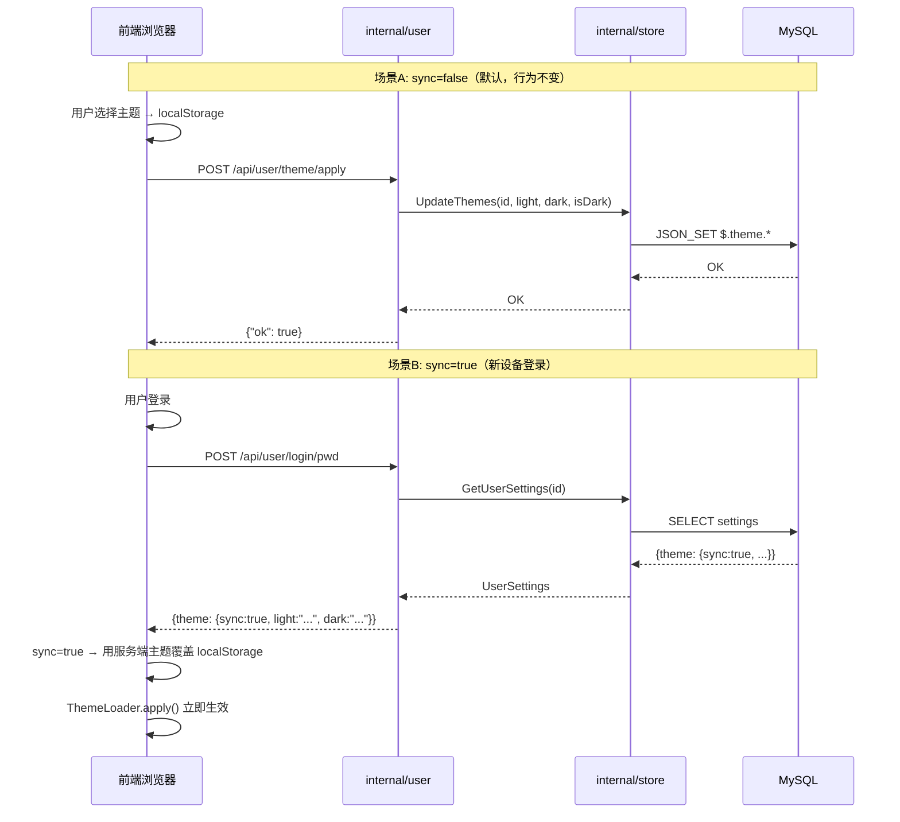

# 主题同步 & 用户包重构 — 实施计划

## 1. 动机

当前主题相关的用户操作（`ApplyUserTheme`）在 `internal/theme/` 包中，但其本质是**用户设置管理**，与主题清单（manifest）读取无关。将用户相关的 handler 抽出到独立的 `internal/user/` 包中，为未来扩展（修改密码、绑定微信等）奠定架构基础。

同时增加可选的跨设备主题同步能力，解决"在不同终端登录后主题不一致"的问题。

---

## 2. 现有架构分析

### 2.1 当前文件依赖关系

```
cmd/server/main.go
  ├── internal/theme/handler.go       ← GetThemeMainfes + ApplyUserTheme
  ├── internal/store/user_settings.go ← UserSettingsTheme + UserStore 方法
  ├── internal/agent/on_login.go      ← 登录响应（不含 theme）
  └── internal/agent/auth.go          ← RequireAuth 中间件
```

### 2.2 当前主题数据流

```
用户选择主题 → localStorage ← 即时生效，离线可用
            → POST /api/theme/apply → MySQL users.settings.$.theme.*
```

### 2.3 当前登录响应（`on_login.go`）

```json
{
  "status": "ok",
  "user_sn": "u-xxx",
  "no": "A12345",
  "avatar": "/static/img/avatar/avatar1.png",
  "chats": [...]
}
```

**不包含主题设置**，因此即使用户在服务端保存了主题偏好，新设备登录后也不会自动应用。

---

## 3. 设计目标

| 目标 | 说明 |
|------|------|
| 分离关注点 | theme 包只管 manifest 读取；user 包管用户设置 |
| 可扩展 | user 包为未来修改密码、绑定微信等提供位置 |
| 默认不同步 | `sync=false` 时行为与现在完全一致 |
| 可选同步 | `sync=true` 时登录后自动拉取主题 |
| 安全 | `GetTheme` 只返回主题设置，不暴露 API key |

---

## 4. 关键技术决策：消除 `resolveSessionID` 重复

### 4.1 问题分析

当前有两份独立的 `resolveSessionID` 实现，逻辑完全相同：

| 所属 Handler | 方法 | 位置 |
|-------------|------|------|
| `agent.ChatAgent` | `getSessionID` | [`internal/agent/on_chat.go:560`](internal/agent/on_chat.go:560) |
| `theme.Handler` | `resolveSessionID` | [`internal/theme/handler.go:80`](internal/theme/handler.go:80) |

如果再为 `user.Handler` 写第三份，重复度太高。

### 4.2 解决方案

在 [`internal/session/`](internal/session/) 包中新增导出函数，所有 Handler 共用：

```go
// ResolveSessionID extracts the session ID from the cookie.
// If no cookie exists, generates a new session ID and sets the cookie.
func ResolveSessionID(w http.ResponseWriter, r *http.Request, cookieName string) string {
    cookie, err := r.Cookie(cookieName)
    if err == nil && cookie.Value != "" {
        return cookie.Value
    }
    sessionID := GenerateSessionID()
    http.SetCookie(w, &http.Cookie{
        Name:     cookieName,
        Value:    sessionID,
        Path:     "/",
        HttpOnly: true,
        SameSite: http.SameSiteLaxMode,
        MaxAge:   86400 * 7,
    })
    return sessionID
}
```

**好处**：
- `user.Handler` 直接调用 `session.ResolveSessionID(w, r, h.cookieName)`，无需重复方法
- `theme.Handler.resolveSessionID` 改为委托给 `session.ResolveSessionID`
- 未来任何新 Handler 都无需重复这段逻辑

---

## 5. 详细变更（共 7 步）

### 5.1 Step 1 — 新增 `session.ResolveSessionID`

**文件**: `internal/session/session.go`（在 `GenerateSessionID` 之后追加）

将 cookie 解析 + 生成逻辑提取为包级导出函数。

### 5.2 Step 2 — `UserSettingsTheme` 增加 `Sync` 字段

**文件**: [`internal/store/user_settings.go`](internal/store/user_settings.go:54-58)

```go
type UserSettingsTheme struct {
    Active string `json:"active"` // "light" or "dark"
    Light  string `json:"light"`  // Light theme ID
    Dark   string `json:"dark"`   // Dark theme ID
    Sync   bool   `json:"sync"`   // 是否跨设备同步主题（默认 false）
}
```

### 5.3 Step 3 — 新增 `UpdateThemeSyncMode` store 方法

**文件**: [`internal/store/user_settings.go`](internal/store/user_settings.go)（在 `UpdateThemeActiveMode` 之后追加）

```go
// UpdateThemeSyncMode updates the $.theme.sync field via MySQL JSON_SET.
func (s *UserStore) UpdateThemeSyncMode(id int64, sync bool) error
```

### 5.4 Step 4 — 新建 `internal/user/theme.go`

**文件**: `internal/user/theme.go`（新建）

#### 包结构

```
internal/user/
  └── theme.go    ← ApplyTheme, GetTheme, UpdateSyncMode
```

#### `Handler` 结构体

```go
package user

import (
    "BrainForever/internal/session"
    "BrainForever/internal/store"
)

type Handler struct {
    sessionManager *session.Manager
    cookieName     string
}

func NewHandler(sessionManager *session.Manager, cookieName string) *Handler
```

**注意**：不再需要 `resolveSessionID` 方法，直接调用 `session.ResolveSessionID(w, r, h.cookieName)`。

#### `ApplyTheme` — POST `/api/user/theme/apply`

从 [`internal/theme/handler.go:ApplyUserTheme`](internal/theme/handler.go:47) 迁移并改名：

1. 解析 JSON 请求体 `{actived, actived-light, actived-dark}`
2. 通过 `session.ResolveSessionID` 获取 sessionID → `h.sessionManager.GetOrCreate(sessionID)` → 取 `userID`
3. 调用 `store.TheUserStore().UpdateThemes(userID, light, dark, isDark)`
4. 同步更新 session 内存中的 `User.Settings.Theme`
5. 返回 `{"ok": true}`

#### `GetTheme` — GET `/api/user/theme`

1. 解析 session → 取 `userID`
2. 调用 `store.TheUserStore().GetUserSettings(userID)`
3. 只返回 `UserSettingsTheme`（**不暴露 API key**）
4. 返回 JSON `{"active": "light", "light": "chaxiang-light", "dark": "chaxiang-dark", "sync": false}`

#### `UpdateSyncMode` — PUT `/api/user/theme/mode`

1. 解析 JSON 请求体 `{sync: true|false}`
2. 解析 session → 取 `userID`
3. 调用 `store.TheUserStore().UpdateThemeSyncMode(userID, sync)`
4. 同步更新 session 内存中的 `User.Settings.Theme.Sync`
5. 返回 `{"ok": true}`

### 5.5 Step 5 — 更新路由注册

**文件**: [`cmd/server/routers.go`](cmd/server/routers.go)

```go
// initRouters 签名变更
func initRouters(srv *httpx.Server, chatHandler *agent.ChatAgent,
    themeHandler *theme.Handler, userHandler *user.Handler) {

    // ... 现有路由不变 ...

    // 删除旧路由
    // srv.POST("/api/theme/apply", chatHandler.RequireAuth(themeHandler.ApplyUserTheme))

    // 新增新路由
    srv.POST("/api/user/theme/apply", chatHandler.RequireAuth(userHandler.ApplyTheme))
    srv.GET("/api/user/theme",        chatHandler.RequireAuth(userHandler.GetTheme))
    srv.PUT("/api/user/theme/mode",   chatHandler.RequireAuth(userHandler.UpdateSyncMode))

    // manifest 路由保持不变
    srv.GET("/api/themes/mainfes", themeHandler.GetThemeMainfes)
}
```

### 5.6 Step 6 — 更新 `main.go`

**文件**: [`cmd/server/main.go`](cmd/server/main.go:175-179)

```go
// 旧
themeHandler := theme.NewHandler(chatHandler.GetSessionManager(), chatHandler.GetCookieName())
initRouters(srv, chatHandler, themeHandler)

// 新
themeHandler := theme.NewHandler(chatHandler.GetSessionManager(), chatHandler.GetCookieName())
userHandler := user.NewHandler(chatHandler.GetSessionManager(), chatHandler.GetCookieName())
initRouters(srv, chatHandler, themeHandler, userHandler)
```

### 5.7 Step 7 — 登录响应增加 `theme` 和 `nickname`

**文件**: [`internal/agent/on_login.go`](internal/agent/on_login.go:134-141)（SMS 登录）和（internal/agent/on_login.go:208-215）（密码登录）

```go
json.NewEncoder(w).Encode(map[string]interface{}{
    "status":   "ok",
    "user_sn":  user.SN,
    "no":       user.No,
    "nickname": user.Nickname,       // ← 新增：前端展示
    "avatar":   avatar,
    "chats":    chats,
    "theme":    userSettings.Theme,  // ← 新增：{active, light, dark, sync}
    "is_new":   isNew,               // 仅 SMS 登录
})
```

### 5.8 Step 8 — 清理旧代码

**文件**: [`internal/theme/handler.go`](internal/theme/handler.go)

- `ApplyUserTheme` 方法 → 删除（已迁移到 `user/theme.go`）
- `resolveSessionID` 方法 → 改为委托 `session.ResolveSessionID`（为保持兼容性，或者直接删除）

---

## 6. 前端处理逻辑

### 6.1 登录成功后

```js
// 伪代码：login response handler
if (response.theme && response.theme.sync) {
    // sync=true：用服务端的主题覆盖 localStorage
    localStorage.setItem('brainforever_theme_light', response.theme.light);
    localStorage.setItem('brainforever_theme_dark', response.theme.dark);
    // 根据 actived 模式立即应用
    ThemeLoader.apply();
} else {
    // sync=false 或不含 theme：什么都不做，保留 localStorage 现有值
}
```

### 6.2 用户切换主题时

```js
// 用户选择新主题后
localStorage.setItem('brainforever_theme_light', newLightId);
localStorage.setItem('brainforever_theme_dark', newDarkId);
ThemeLoader.apply();

// 如果 sync=true，同步到服务端
if (currentUser.themeSync) {
    fetch('/api/user/theme/apply', { method: 'POST', body: JSON.stringify({...}) });
}
```

### 6.3 用户切换同步开关时

```js
fetch('/api/user/theme/mode', {
    method: 'PUT',
    body: JSON.stringify({ sync: true })
});
```

---

## 7. 数据流图



---

## 8. 安全边界

| 检查项 | 措施 |
|--------|------|
| 未登录访问 | 所有 user 路由都经过 `RequireAuth`，返回 401 |
| 暴露 API key | `GetTheme` 只返回 `UserSettingsTheme`，不返回 `UserSettingsAPIKey` |
| 越权修改 | 通过 session 解析 userID，用户只能改自己的设置 |
| 旧路由残留 | 删除 `/api/theme/apply` 后，旧路径返回 405 Method Not Allowed |

---

## 9. 实施顺序

```
Step 1: internal/session/ — 新增 ResolveSessionID 导出函数
Step 2: internal/store/user_settings.go — UserSettingsTheme.Sync + UpdateThemeSyncMode
Step 3: internal/user/theme.go — 新建文件，三个 handler
Step 4: cmd/server/routers.go — 新路由，删除旧路由
Step 5: cmd/server/main.go — userHandler 初始化
Step 6: internal/agent/on_login.go — 响应增加 theme + nickname
Step 7: internal/theme/handler.go — 删除 ApplyUserTheme，resolveSessionID 委托 session
```

每个步骤独立可测试，Step 3 和 Step 7 没有严格先后关系。
