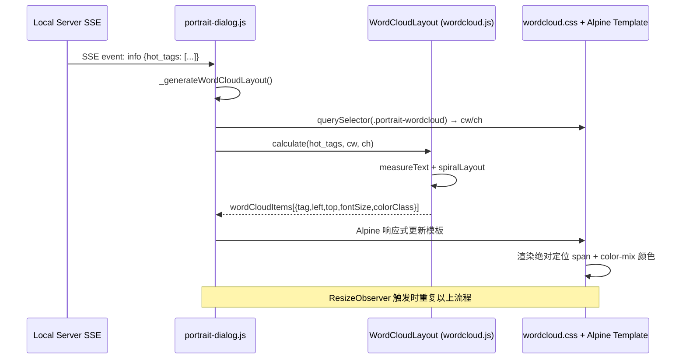

# 词云集成方案 v3 — 独立组件化

## 目标

将 [`html_demo/word_cloud.html`](../html_demo/word_cloud.html) 的椭圆螺旋算法提取为独立组件，供用户画像对话框左侧「话题热区」词云使用。

## 设计原则

| # | 要求 | 方案 |
|---|------|------|
| 1 | 只引入算法，不引入无关 UI | 新建组件仅包含布局算法+样式；不引入按钮/输入框等 |
| 2 | 尺寸以画像对话框实际区域为准 | 运行时动态读取 `.portrait-wordcloud` 容器尺寸 |
| 3 | 支持浏览器 resize 动态调整 | `ResizeObserver` 监听容器，变化时自动重排 |
| 4 | 颜色与当前主题呼应 | CSS 用 `color-mix(in srgb, <base>, var(--accent) 15%)` |

## 改动总览

```
新增 2 个文件：
  frontend/static/components/wordcloud.js    ← 椭圆螺旋布局算法
  frontend/static/components/wordcloud.css   ← 词云样式 + 颜色类

修改 3 个文件：
  frontend/static/dialogs/portrait-dialog.js ← 替换方法体，调用组件
  frontend/static/dialogs/portrait-dialog.css← 移除词云相关样式
  frontend/index.html                         ← 添加 wordcloud.css/js 引用
```

---

## 文件 1: `frontend/static/components/wordcloud.js`（新增）

纯算法组件，通过 `window.WordCloudLayout` 暴露。包含：

### 对外接口

```javascript
window.WordCloudLayout = {
    /**
     * 计算词云布局
     * @param {Array<{tag:string, count:number}>} tags  - 按 count 降序排列
     * @param {number} cw  - 容器宽度（px）
     * @param {number} ch  - 容器高度（px）
     * @returns {Array<{tag, count, left, top, fontSize, colorClass}>}
     */
    calculate: function(tags, cw, ch) { ... }
};
```

### 内部算法（从 demo 移植）

1. **`measureText(text, fontSize)`** — 创建隐藏 span 精确测量文本宽高
2. **`isOverlapping(a, b, pad)`** — AABB 碰撞检测
3. **`spiralLayout(tags, cw, ch)`** — 椭圆螺旋布局：
   - 按 count 降序 → 最大词居中
   - 后续词沿椭圆螺旋（`aspectFactor = cw/ch > 1.2 ? 1.8 : 1.2`）向外搜索
   - 碰撞检查 + 边界检查
   - 6000 次尝试上限 → 兜底随机放置
4. **字号映射**：14px ~ min(48, max(22, ch/5))，smoothstep 缓动 `t²(3-2t)`
5. **颜色**：36 色调色板，通过 `colorClass`（`i % 10`）输出，CSS 层处理主题混色

---

## 文件 2: `frontend/static/components/wordcloud.css`（新增）

从 `portrait-dialog.css` 迁移词云相关样式，并增强：

### 容器样式

```css
.portrait-wordcloud {
    position: relative;
    width: 100%;
    height: 200px;
    overflow: hidden;
}
```

### 词条样式

```css
.portrait-wordcloud-item {
    position: absolute;
    font-weight: 700;
    cursor: default;
    white-space: nowrap;
    transition: transform 0.25s ease, opacity 0.2s ease;
    opacity: 0.80;
}
.portrait-wordcloud-item:hover {
    transform: scale(1.2) !important;
    opacity: 1;
    z-index: 10;
}
```

### 颜色类（主题共鸣）

```css
.portrait-wordcloud-c1  { color: color-mix(in srgb, #FF6B6B, var(--accent) 15%); }
.portrait-wordcloud-c2  { color: color-mix(in srgb, #4ECDC4, var(--accent) 15%); }
.portrait-wordcloud-c3  { color: color-mix(in srgb, #45B7D1, var(--accent) 15%); }
.portrait-wordcloud-c4  { color: color-mix(in srgb, #96CEB4, var(--accent) 15%); }
.portrait-wordcloud-c5  { color: color-mix(in srgb, #FFD93D, var(--accent) 15%); }
.portrait-wordcloud-c6  { color: color-mix(in srgb, #DDA0DD, var(--accent) 15%); }
.portrait-wordcloud-c7  { color: color-mix(in srgb, #6BCB77, var(--accent) 15%); }
.portrait-wordcloud-c8  { color: color-mix(in srgb, #FF8C42, var(--accent) 15%); }
.portrait-wordcloud-c9  { color: color-mix(in srgb, #BB8FCE, var(--accent) 15%); }
.portrait-wordcloud-c10 { color: color-mix(in srgb, #74B9FF, var(--accent) 15%); }
```

---

## 文件 3: `frontend/static/dialogs/portrait-dialog.js`（修改）

### `_generateWordCloudLayout()` 精简为：

```javascript
_generateWordCloudLayout: function() {
    var info = this.portraitInfo;
    if (!info || !info.hot_tags || !info.hot_tags.length) {
        this.wordCloudItems = [];
        return;
    }

    var container = this.$el ? this.$el.querySelector('.portrait-wordcloud') : null;
    var cw = container ? container.clientWidth : 320;
    var ch = container ? container.clientHeight : 200;
    if (cw < 50 || ch < 50) {
        this.wordCloudItems = [];
        return;
    }

    this.wordCloudItems = window.WordCloudLayout.calculate(info.hot_tags, cw, ch);
}
```

### `open()` 中新增 ResizeObserver：

```javascript
// 在 open() 方法中，this.$nextTick 回调内：
var cloudContainer = self.$el.querySelector('.portrait-wordcloud');
if (cloudContainer) {
    self._resizeObserver = new ResizeObserver(function() {
        if (self.portraitInfo && self.portraitInfo.hot_tags && self.portraitInfo.hot_tags.length) {
            self._generateWordCloudLayout();
        }
    });
    self._resizeObserver.observe(cloudContainer);
}
```

### `close()` 中清理：

```javascript
if (this._resizeObserver) {
    this._resizeObserver.disconnect();
    this._resizeObserver = null;
}
```

### 额外状态：

```javascript
// 在 return 的对象中新增：
_resizeObserver: null,
```

---

## 文件 4: `frontend/static/dialogs/portrait-dialog.css`（修改）

**删除**以下样式块（已移至 `wordcloud.css`）：

- `.portrait-wordcloud` 容器（原第 771-777 行）
- `.portrait-wordcloud-item` 词条（原第 779-793 行）
- `.portrait-wordcloud-c1` ~ `c10` 颜色类（原第 796-805 行）

**保留**其他所有样式（书签、印象速写、信息区、header/footer 等）。

---

## 文件 5: `frontend/index.html`（修改）

在 CSS 加载区（约第 61 行附近）追加：

```html
<link rel="stylesheet" href="/static/components/wordcloud.css">
```

在 JS 加载区（约第 101 行附近）追加：

```html
<script src="/static/components/wordcloud.js"></script>
```

**注意**：`wordcloud.js` 要在 `portrait-dialog.js` 之前加载，因为后者依赖 `window.WordCloudLayout`。

---

## 数据流



---

## 影响范围

| 方面 | 评估 |
|------|------|
| 功能影响 | 仅影响词云渲染效果，不影响 SSE/复制/分享/书签等功能 |
| 性能 | `measureText()` 少量 DOM 操作，10-20 词可忽略 |
| 浏览器兼容 | 需 `ResizeObserver` (Chrome 64+) + `color-mix` (Chrome 111+) |
| 回退 | 删除 `wordcloud.js/css` + `index.html` 引用 + 恢复 `portrait-dialog.js/css` 即可 |

---

## 执行清单

1. 新建 `frontend/static/components/wordcloud.js`
2. 新建 `frontend/static/components/wordcloud.css`
3. 修改 `frontend/static/dialogs/portrait-dialog.js`：简化 + ResizeObserver
4. 修改 `frontend/static/dialogs/portrait-dialog.css`：删除词云样式
5. 修改 `frontend/index.html`：添加引用
6. 浏览器验证
