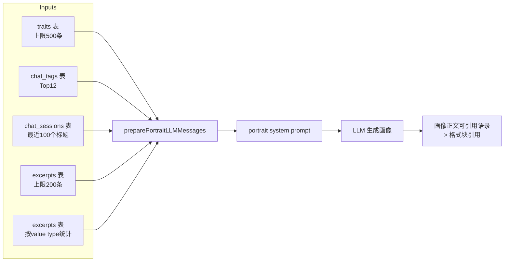

# 用户画像增强：融入语录数据的实施计划

## 背景

当前"用户画像"（AI 印象）生成过程中，LLM 仅接收三类输入：
1. 个人特征条目（traits 表）
2. 热门话题标签（chat_tags 表）
3. 最近对话标题（chat_sessions 表）

系统中已存在的**用户语录**（excerpts 表，14 类价值分类）未被纳入画像生成流程。

## 变更范围

### 目标
将用户语录信息注入 LLM Prompt，使生成的画像更丰富、更有温度，允许 LLM 直接引用精彩语录原文。

### 约束（用户确认）
1. **Traits 上限**：最多 500 条最新的
2. **无 UI 变更**：对话框左栏不新增语录展示区
3. **Excerpts 上限**：最多 200 条最新的
4. **Prompt 要求**：鼓励 LLM 直接引用个别特别好的语录（Markdown 引用格式）

---

## 修改清单

### 1. Store 层 — [`internal/store/excerpts.go`](internal/store/excerpts.go)

新增两个查询方法：

#### a. `CountExcerptsByValueTypes(userID int64) (map[int16]int, error)`
- 统计用户各 value type 的语录分布数量
- SQL: `SELECT unnest(values) AS vt, COUNT(*) FROM excerpts WHERE user_id=$1 GROUP BY vt`
- 用于生成"14 类价值分类分布统计"

#### b. `ListLatestExcerpts(userID int64, limit int) ([]Excerpt, error)`
- 按 `create_at DESC` 取最新的 N 条语录（上限 200）
- 用于提供给 LLM 作为"精选语录"素材

### 2. Agent 层 — [`internal/agent/on_portrait.go`](internal/agent/on_portrait.go)

在 `preparePortraitLLMMessages` 函数中新增：

#### a. 读取语录统计分布
```go
excerptValueStats, err := theExcerptStore.CountExcerptsByValueTypes(userID)
// 格式示例：insight(23), humor(15), conviction(8)...
```

#### b. 读取最新语录（上限 200 条）
```go
latestExcerpts, err := theExcerptStore.ListLatestExcerpts(userID, 200)
// 包含：content, context_summary, reason, value_types, msg_time
```

#### c. 格式化语录数据字符串
新增 `formatExcerptsForPortrait` 函数，将语录数据格式化为 LLM 可读的文本。

#### d. 注入 portrait system prompt
在 `systemContent` 模板变量中新增：
- `{{.ExcerptStats}}` — 语录分类统计
- `{{.RecentExcerpts}}` — 最新精选语录

#### e. Traits 上限约束
在 `tryListUserTraits` 或 `preparePortraitLLMMessages` 中，若 traits 超过 500 条，截取最新的 500 条。

### 3. 系统 Prompt — [`lang/zh-CN/system_prompt.toml`](lang/zh-CN/system_prompt.toml)

在 `[portrait]` section 中新增一段：

```toml
{{if .ExcerptStats}}
此外，系统收录了你在对话中的精彩言论（语录），各类型分布如下：
{{.ExcerptStats}}
{{end}}

{{if .RecentExcerpts}}
以下是你的部分精彩语录原文（附上下文及入选理由），可供参考引用：
{{.RecentExcerpts}}

在撰写画像时，可以适当直接引用个别特别精彩的语录原文（使用 Markdown 块引用格式 >），以增强画像的生动性和真实感。
{{end}}
```

### 4. 系统 Prompt — [`lang/en/system_prompt.toml`](lang/en/system_prompt.toml)

同上，英文版对应修改。

---

## 数据流（变更后）



---

## 实现顺序

| Step | 文件 | 内容 |
|------|------|------|
| 1 | [`internal/store/excerpts.go`](internal/store/excerpts.go) | 新增 `CountExcerptsByValueTypes` + `ListLatestExcerpts` |
| 2 | [`internal/agent/on_portrait.go`](internal/agent/on_portrait.go) | 新增 `formatExcerptsForPortrait` + 注入逻辑 |
| 3 | [`lang/zh-CN/system_prompt.toml`](lang/zh-CN/system_prompt.toml) | 新增语录说明段 |
| 4 | [`lang/en/system_prompt.toml`](lang/en/system_prompt.toml) | 同上（英文版） |

## 注意事项

- 语录中的 `privacy` 标签条目：用户确认无需特别过滤（用户自己的数据展示给自己无隐私问题）
- 注入 prompt 的语录数量：200 条看似多，但每条仅包含原文(≤380字) + 上下文(≤520字) + 原因(≤400字)，实际可按需精简字段（仅原文+上下文即可）
- 建议对 200 条按 msg_time 逆序排列，最新的最有参考价值
