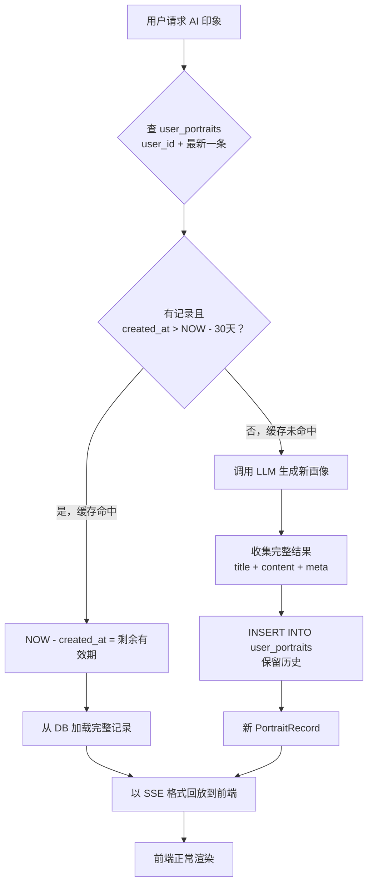

# 用户画像（AI 印象）持久化与缓存方案

## 需求概述

1. **持久化**：每次生成的"AI 印象"完整结果存入 PostgreSQL，**所有历史记录永久保留**
2. **缓存**：距上次生成不足 1 个月，加载最新记录 SSE 回放，不再调用 LLM
3. **查询能力**：支持按用户查询最新 / 历史画像记录

## 数据表设计

### SQL 定义

```sql
-- ============================================================
-- user_portraits table: persisted user portrait (AI impression)
-- All historical records are kept permanently.
-- ============================================================
CREATE TABLE IF NOT EXISTS user_portraits (
    id              BIGSERIAL    PRIMARY KEY,
    user_id         BIGINT       NOT NULL REFERENCES users(id) ON DELETE CASCADE,
    
    -- LLM-generated content
    title           TEXT         NOT NULL DEFAULT '',      -- 文档标题，如"代码与诗同行的中年摆渡人"
    content         TEXT         NOT NULL DEFAULT '',      -- 画像正文 Markdown
    
    -- Structured metadata (JSONB for flexibility)
    core_traits     JSONB        NOT NULL DEFAULT '[]',   -- 人格标签 ["理性", "真诚", "独立"]
    key_highlights  JSONB        NOT NULL DEFAULT '[]',   -- 印象速写 ["善于深度思考", ...]
    hot_tags        JSONB        NOT NULL DEFAULT '[]',   -- 话题热区 [{"tag":"科技","count":15}, ...]
    hottest_tag     TEXT         NOT NULL DEFAULT '',     -- 反范式：最热 tag 名称，方便 SQL 级查询
    hottest_tag_count INT       NOT NULL DEFAULT 0,      -- 反范式：最热 tag 计数
    
    -- Base info
    chat_count      INT          NOT NULL DEFAULT 0,
    trait_count     INT          NOT NULL DEFAULT 0,
    span_days       INT          NOT NULL DEFAULT 0,
    earliest_date   DATE,
    latest_date     DATE,
    retouch         INT          NOT NULL DEFAULT 3,
    
    created_at      TIMESTAMPTZ  NOT NULL DEFAULT NOW(),
    
    CONSTRAINT fk_user_portraits_user FOREIGN KEY (user_id) REFERENCES users(id) ON DELETE CASCADE
);

-- Index for "latest portrait per user" lookup
CREATE INDEX IF NOT EXISTS idx_user_portraits_user_id ON user_portraits(user_id);
CREATE INDEX IF NOT EXISTS idx_user_portraits_user_created ON user_portraits(user_id, created_at DESC);
```

### 设计说明

| 要点 | 方案 |
|------|------|
| **历史保留** | 每次生成 INSERT 新行，永不删除 |
| **最新记录查询** | `WHERE user_id=$1 ORDER BY created_at DESC LIMIT 1` |
| **hot_tags 查询** | 应用层 Go 代码遍历 JSONB 数组查找最热 tag，无需 SQL 层展开 |
| **JSONB 灵活性** | 未来可扩展字段而不改表结构（如加入 `excerpt_stats`、`model_version` 等） |

## 缓存策略



### 关键细节

1. **每用户多行**：使用 `INSERT` 而非 `UPSERT`，保留所有历史
2. **最新记录判断**：`SELECT ... WHERE user_id=$1 ORDER BY created_at DESC LIMIT 1`
3. **30 天判断**：Go 代码中 `time.Since(record.CreatedAt) < 30*24*time.Hour`
4. **`?regen=true`**：URL 参数强制重新生成，忽略缓存
5. **SSE 回放兼容**：缓存的记录组装为与 LLM 流相同的 SSE 事件序列

### SSE 回放格式

```javascript
event: info   -> portraitInfoData (chat_count, trait_count, span_days, hot_tags, generated_at=created_at)
event: text   -> content (完整正文一次性发送)
event: meta   -> { core_traits: [...], key_highlights: [...] }
event: done   -> {}
```

## 存储层设计

### 新增 `internal/store/portraits.go`

```go
package store

type UserPortrait struct {
    ID            int64         `db:"id"`
    UserID        int64         `db:"user_id"`
    Title         string        `db:"title"`
    Content       string        `db:"content"`
    CoreTraits    []string      `db:"core_traits"`     // JSONB
    KeyHighlights []string      `db:"key_highlights"`  // JSONB
    HotTags       []HotTagItem  `db:"hot_tags"`        // JSONB
    ChatCount     int           `db:"chat_count"`
    TraitCount    int           `db:"trait_count"`
    SpanDays      int           `db:"span_days"`
    EarliestDate  *time.Time    `db:"earliest_date"`
    LatestDate    *time.Time    `db:"latest_date"`
    Retouch       int           `db:"retouch"`
    CreatedAt     time.Time     `db:"created_at"`
}

// HotTagItem represents a single hot tag entry in the JSONB array.
type HotTagItem struct {
    Tag   string `json:"tag"`
    Count int    `json:"count"`
}

type PortraitStore struct {
    logger zylog.Logger
}

func NewPortraitStore(logger zylog.Logger) *PortraitStore

// GetLatestPortrait returns the most recent portrait for a user.
// Returns nil and no error if no record exists yet.
func (s *PortraitStore) GetLatestPortrait(userID int64) (*UserPortrait, error)

// InsertPortrait saves a new portrait record (history is kept).
func (s *PortraitStore) InsertPortrait(p *UserPortrait) (int64, error)

// ListPortraits returns all portraits for a user, newest first.
func (s *PortraitStore) ListPortraits(userID int64, limit, offset int) ([]UserPortrait, error)
```

### JSONB 序列化

Go 标准库 + PostgreSQL JSONB 配合使用 `json.Marshal`/`json.Unmarshal`。参考 `Int16Array` 模式，可复用 `StringArray` 类型：

```go
// StringArray wraps []string for JSONB columns (Scanner/Valuer)
type StringArray []string

func (a *StringArray) Scan(src interface{}) error { ... }
func (a StringArray) Value() (driver.Value, error) { ... }
```

或直接使用 `sqlx` 的 JSON 标签 + `pq.StringArray`（视实际 driver 而定）。

## Agent 层修改

### `internal/agent/on_portrait.go` — 修改 `OnGetUserPortrait`

```go
func (h *ChatAgent) OnGetUserPortrait(w http.ResponseWriter, r *http.Request) {
    retouch := getRetouch(r)
    regen := r.URL.Query().Get("regen") == "true"  // ?regen=true 强制重新生成
    
    // 1. 检查缓存（除非 regen）
    if !regen {
        cached, err := thePortraitStore.GetLatestPortrait(sess.User.ID)
        if err == nil && cached != nil {
            age := time.Since(cached.CreatedAt)
            if age < 30*24*time.Hour {
                h.replayPortraitFromCache(w, cached, lang)
                return
            }
        }
    }
    
    // 2. 缓存未命中 → 原有 LLM 生成流程（略）
    // ...
    
    // 3. LLM 完成后，收集完整结果并 INSERT 到 user_portraits
    portraitRecord := &store.UserPortrait{
        UserID:        sess.User.ID,
        Title:         portraitTitle,
        Content:       totalContent,
        CoreTraits:    meta.CoreTraits,
        KeyHighlights: meta.KeyHighlights,
        HotTags:       hotTags,       // []HotTagItem → json.Marshal
        ChatCount:     chatCount,
        TraitCount:    traitCount,
        SpanDays:      spanDays,
        EarliestDate:  earliestDate,
        LatestDate:    latestDate,
        Retouch:       retouch,
    }
    if _, err := thePortraitStore.InsertPortrait(portraitRecord); err != nil {
        // 非关键操作，仅打日志，不影响前端展示
        log.Printf("failed to persist portrait: %v", err)
    }
}
```

### 新增 `replayPortraitFromCache`

```go
func (h *ChatAgent) replayPortraitFromCache(w http.ResponseWriter, p *store.UserPortrait, lang string) {
    w.Header().Set("Content-Type", "text/event-stream")
    // ... 发送 SSE events: info → text → meta → done
}
```

从缓存记录中提取 `portraitInfoData`、正文、`core_traits`/`key_highlights`，按序发送 SSE 事件。

### 标题生成时机

当前标题通过 `POST /api/user/portrait/title` 由前端单独请求。

**建议方案**：后端 LLM 流完成后，在返回 `done` 事件前，内部调用一次 LLM 生成标题，然后将标题一并存入 `user_portraits.title`。这样：
- 一次 SSE 请求拿到全部数据
- 前端无需再调 title API
- 缓存回放时标题也直接可用

## 修改清单

| 步骤 | 文件 | 内容 |
|------|------|------|
| 1 | `bin/init_sql/007.user_portraits.sql` | 新增建表 SQL |
| 2 | `internal/store/portraits.go` | 新增文件：`PortraitStore`（GetLatestPortrait + InsertPortrait + ListPortraits） |
| 3 | `internal/agent/init.go` | 注册 `thePortraitStore` 全局变量 |
| 4 | `internal/agent/on_portrait.go` | 修改 `OnGetUserPortrait`：缓存检查/回放/持久化 |
| 5 | `internal/agent/on_portrait.go` | 新增 `replayPortraitFromCache` 函数 |
| 6 | `internal/agent/on_portrait.go` | 标题生成提前到后端内部（可选） |
| 7 | 前端 `portrait-dialog.js` | 若标题改由后端生成，可移除 title API 调用（可选） |

## 未决问题

1. **hot_tags 查询**：您确认当前 JSONB 方案即可，不反范式化 → 应用层遍历找最热 tag
2. **历史保留**：所有 INSERT 保留，永不删除 → 后期可考虑添加用户可见的历史列表 UI
3. **标题生成时机**：是否改为后端内部生成标题一并存入？
