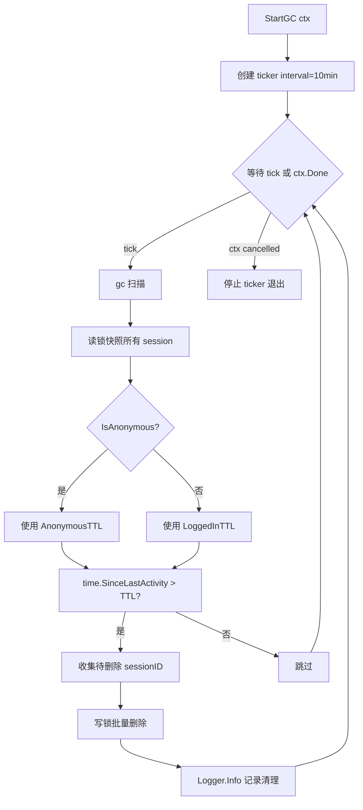

# Session 内存 GC 实现计划

## 现状

| 层级 | 有 GC？ | 说明 |
|------|---------|------|
| Redis 登录态 | ✅ 有 | TTL 7 天自动过期，`RefreshTTL` 在活跃请求时刷新 |
| 内存 `Sessions map` | ❌ 没有 | `LastActivity` 字段存在，但无任何清理逻辑 |

## 设计

### 1. 新增 `SessionGCConfig` 配置结构体（TOML 可配置）

在 [`internal/config/config.go`](internal/config/config.go) 中新增：

```go
// SessionGCConfig configures the in-memory session garbage collector.
type SessionGCConfig struct {
    // AnonymousTTLMinutes is the max idle time (minutes) before an anonymous session is evicted.
    AnonymousTTLMinutes int `toml:"anonymous_ttl_minutes"`
    // LoggedInTTLMinutes is the max idle time (minutes) before a logged-in session is evicted.
    LoggedInTTLMinutes int `toml:"logged_in_ttl_minutes"`
    // IntervalMinutes is how often (minutes) the GC sweep runs.
    IntervalMinutes int `toml:"interval_minutes"`
}
```

在 `Config` 结构体中新增字段：

```go
type Config struct {
    // ...existing fields...
    SessionGC SessionGCConfig `toml:"session-gc"`
}
```

在 `DefaultConfig()` 中设置默认值：

```go
func DefaultConfig() Config {
    return Config{
        // ...existing defaults...
        SessionGC: SessionGCConfig{
            AnonymousTTLMinutes:  60,   // 1 小时
            LoggedInTTLMinutes:   1440, // 24 小时
            IntervalMinutes:      10,   // 10 分钟
        },
    }
}
```

### 2. 在 `Manager` 中新增 GC 字段

在 [`internal/session/manager.go`](internal/session/manager.go) 中修改 `Manager` 结构体：

```go
type Manager struct {
    Mu       sync.RWMutex
    Sessions map[string]*Session
    redis    *cache.RedisSessionStore
    Ctx      context.Context
    logger   zylog.Logger
    gcConfig GCConfig          // new: runtime GC config
    gcStop   context.CancelFunc // new: to stop the GC goroutine
}
```

新增内置 `GCConfig` 结构体（与 TOML 配置解耦，直接用 `time.Duration`）：

```go
// GCConfig holds the runtime configuration for the in-memory session GC.
type GCConfig struct {
    AnonymousTTL time.Duration
    LoggedInTTL  time.Duration
    Interval     time.Duration
}

// DefaultGCConfig returns sensible defaults when no TOML config is provided.
func DefaultGCConfig() GCConfig {
    return GCConfig{
        AnonymousTTL: 1 * time.Hour,
        LoggedInTTL:  24 * time.Hour,
        Interval:     10 * time.Minute,
    }
}
```

新增 `FromTOMLConfig` 方法，将 TOML 配置转换为运行时配置：

```go
// FromTOMLConfig converts a config.SessionGCConfig to a GCConfig.
func FromTOMLConfig(cfg config.SessionGCConfig) GCConfig {
    return GCConfig{
        AnonymousTTL: time.Duration(cfg.AnonymousTTLMinutes) * time.Minute,
        LoggedInTTL:  time.Duration(cfg.LoggedInTTLMinutes) * time.Minute,
        Interval:     time.Duration(cfg.IntervalMinutes) * time.Minute,
    }
}
```

### 3. 修改 `NewManager` 接受 GC 配置

```go
func NewManager(logger zylog.Logger, gcConfig GCConfig) *Manager {
    return &Manager{
        Sessions: make(map[string]*Session),
        Ctx:      context.Background(),
        logger:   logger,
        gcConfig: gcConfig,
    }
}
```

> 保持向后兼容：如果不传配置则使用 `DefaultGCConfig()`。

### 4. 新增 `StartGC` 方法

```go
// StartGC starts the background session GC goroutine.
// The GC periodically sweeps expired sessions from memory.
// The goroutine stops when ctx is cancelled.
// Must only be called once per Manager.
func (m *Manager) StartGC(ctx context.Context) {
    // 1. Create a cancellable context for internal cleanup
    // 2. Launch a goroutine with time.NewTicker(m.gcConfig.Interval)
    // 3. On each tick, call m.gc() to sweep
}
```

### 5. 新增 `gc` 扫描方法

```go
// gc performs one sweep of expired sessions.
// Called periodically by the GC goroutine.
func (m *Manager) gc() {
    // 1. Acquire m.Mu.RLock(), snapshot the map keys + LastActivity
    // 2. For each session, determine TTL based on IsAnonymous():
    //    - anonymous → m.gcConfig.AnonymousTTL
    //    - logged-in → m.gcConfig.LoggedInTTL
    // 3. If time.Since(s.LastActivity) > ttl, mark for removal
    // 4. Release RLock
    // 5. If any expired, acquire m.Mu.Lock() and delete them
    // 6. Log the cleanup via m.logger
}
```

> **设计考量**：先读锁快照再写锁删除，避免长时间持有写锁影响业务请求。

### 6. 集成点

在 [`internal/agent/init.go`](internal/agent/init.go:92) 的 `InitAgent` 中：

```go
// 创建 ChatAgent（需传入 gcConfig）
chatHandler := NewChatHandler(
    cookieName, defaultLang, avatarDir, logger,
    session.FromTOMLConfig(cfg.SessionGC),
)

// 在 InitAgent 末尾，return 之前
chatHandler.GetSessionManager().StartGC(ctx)
```

修改 `NewChatHandler` 签名，接收 `session.GCConfig` 参数。

### 7. TOML 配置模板

在 [`deploy/settings_template/server.template.toml`](deploy/settings_template/server.template.toml) 中新增：

```toml
# ============================================================
# Session 内存 GC 配置（可选）
# 控制内存中 session 对象的自动清理。
# ============================================================
[session-gc]
# 匿名 session 无活动超过此时间（分钟）则从内存中清除
anonymous_ttl_minutes = 60
# 已登录 session 无活动超过此时间（分钟）则从内存中清除
logged_in_ttl_minutes = 1440
# GC 扫描间隔（分钟）
interval_minutes = 10
```

### 8. GC 逻辑流程图



### 9. 边界情况

| 场景 | 处理方式 |
|------|----------|
| GC 正在删除一个 session 的同时，有请求进来 `GetOrCreate` | 写锁保证互斥；请求会创建新 session |
| Session 正在 streaming 时被 GC 删除 | **⚠️ 存在风险。** `LastActivity` 仅在 [`GetOrCreate`](internal/session/manager.go:128) 中更新，streaming 期间**不会**更新该字段。长时间流式（>TTL）会导致 session 被误删。详见下方 §10 |
| 匿名和已登录用户使用不同 TTL | `IsAnonymous()` 已在 [`Session`](internal/session/session.go:164) 中实现，可以直接复用 |
| 服务关闭 | 通过 `ctx.Done()` 通知 GC goroutine 退出 |
| TOML 文件未配置 `[session-gc]` | `DefaultConfig()` 提供合理的默认值 |

## 修改文件清单

| 文件 | 改动内容 |
|------|----------|
| [`internal/config/config.go`](internal/config/config.go) | 新增 `SessionGCConfig` 结构体，`Config` 新增字段，`DefaultConfig` 设置默认值 |
| [`internal/session/manager.go`](internal/session/manager.go) | 新增 `GCConfig`、`DefaultGCConfig()`、`FromTOMLConfig()`、`StartGC()`、`gc()`；修改 `Manager` 和 `NewManager` |
| [`internal/agent/init.go`](internal/agent/init.go) | 在 `InitAgent` 中将配置传入 `NewChatHandler`，末尾调用 `StartGC(ctx)` |
| [`internal/agent/on_chat.go`](internal/agent/on_chat.go) | 修改 `NewChatHandler` 签名接受 `session.GCConfig` |
| [`deploy/settings_template/server.template.toml`](deploy/settings_template/server.template.toml) | 新增 `[session-gc]` 配置节 |

## 10. 实际风险分析——正在聊天的会话是否可能被误回收

### 10.1 `LastActivity` 更新时机

仅有的更新点：[`GetOrCreate`](internal/session/manager.go:128) 在每次 HTTP 请求进入 handler 时调用。

```go
sessionID := h.resolveSessionID(w, r)
sess := h.sessionManager.GetOrCreate(sessionID)  // ← 仅在这里更新 LastActivity
```

在 [`callLLMWithPipeline`](internal/agent/chatllm.go:174)（流式响应的整个生命周期）中，**没有任何代码更新 `LastActivity`**。

### 10.2 时序风险

```
（匿名用户，TTL=1h）
T=0      用户发送 → OnNewMessage → GetOrCreate() 设置 LastActivity=T0
T=~10s   流式进行中...（LastActivity 不再更新）
T=+60min GC 扫描 → time.Since(T0) > 1h → 从 m.Sessions map 中删除
```

### 10.3 不同用户类型的风险等级

| 用户类型 | TTL | 风险 | 原因 |
|---|---|---|---|
| **已登录用户** | **24h** | ✅ **几乎没有** | 没有任何 LLM 流式响应持续 24 小时 |
| **匿名用户** | **1h** | ⚠️ **极低** | 典型流式几秒~几分钟；持续 >1h 的流式极罕见 |

### 10.4 被回收后的影响

- **不会崩溃**：GC 仅从 `m.Sessions` map 中删除键值对；正在执行的 handler 仍持有 [`*session.Session`](internal/session/session.go:81) 指针，可继续写入
- **状态丢失**：用户发起新请求时，[`GetOrCreate`](internal/session/manager.go:163) 会创建**全新 session**，内存状态（`CurrentChat.Messages` 消息缓存等）丢失
- **数据不丢**：流式结果已在 [`persistMessageToDB`](internal/agent/on_msg_new.go:196) 中写入 DB

### 10.5 最可能的出问题场景

1. 用户发消息后走开 >TTL 时间（匿名 1h / 已登录 24h），回来操作 → session 已重建，内存聊天列表、当前会话状态丢失
2. 多标签页：A 标签页正在流式，B 标签页长时间无操作 → A 的流式可能被 GC 误删（极低概率）

### 10.6 后续优化方向（可选）

如需彻底消除风险，可在 [`callLLMWithPipeline`](internal/agent/chatllm.go:174) 中定期刷新 `sess.LastActivity`，例如：

```go
// 在流式回调中每隔 5 分钟刷新一次
go func() {
    ticker := time.NewTicker(5 * time.Minute)
    defer ticker.Stop()
    for {
        select {
        case <-ticker.C:
            sess.Mu.Lock()
            sess.LastActivity = time.Now()
            sess.Mu.Unlock()
        case <-ctx.Done():
            return
        }
    }
}()
```

但鉴于 TTL（1h/24h）远大于典型流式耗时，此优化优先级很低。

## 实现顺序

1. 在 `config.go` 中定义 `SessionGCConfig` 结构体和默认值
2. 在 `manager.go` 中定义 `GCConfig`、`FromTOMLConfig()`、`DefaultGCConfig()`
3. 修改 `Manager` 结构体，增加 `gcConfig`、`gcStop` 字段
4. 修改 `NewManager` 接受 `GCConfig` 参数
5. 实现 `gc()` 扫描方法（核心逻辑）
6. 实现 `StartGC(ctx)` 启动后台 goroutine
7. 修改 `NewChatHandler` 签名传递配置
8. 在 `InitAgent` 中集成 `StartGC`
9. 更新 TOML 配置模板
