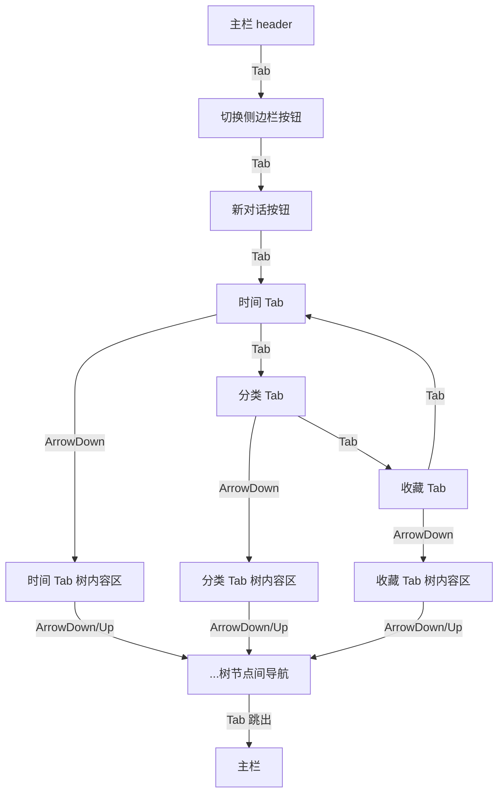
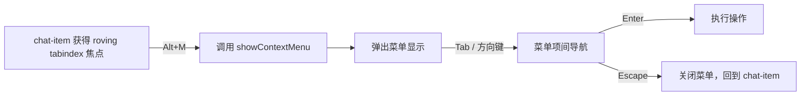

# 键盘导航与焦点管理完整方案

> **实施分三步**：
> - **Phase 1**：左侧边栏（Tab栏 + 树导航 + 上下文菜单）
> - **Phase 2**：主栏 Header Tab 顺序 + 消息区 Tab 顺序
> - **Phase 3**：右侧刻度导航面板

## 1. 背景分析

### 1.1 当前现状

单页面应用使用 Alpine.js 响应式框架，结构如下：

```
.app-container
├── .left-sidebar (侧边栏)
│   ├── .sidebar-header
│   │   ├── .left-brand-area (品牌 / 切换按钮)
│   │   ├── .sidebar-new-chat-area (新对话按钮)
│   │   └── .sidebar-close-btn (关闭按钮)
│   ├── .sidebar-tabs (三个 Tab 按钮: 时间 | 分类 | 收藏)
│   └── .sidebar-content (三个 x-show 驱动的 Tab 内容区)
│       ├── timeline (时间线 — 普通分组 + 更早分组 + 回收站)
│       ├── category (分类 — 按 tag 分组)
│       └── favorites (收藏 — 按 customTag 分组)
└── .main-content (主栏)
    ├── .main-header (标题栏, 含切换按钮、新对话、主题等)
    ├── .main-body (消息区)
    └── .input-area (输入面板)
```

### 1.2 已实现的键盘功能

| 热键 | 功能 | 位置 |
|------|------|------|
| `F2` | 聚焦输入框 | `chat.js:1013-1025` |
| `Ctrl+B` | 切换左侧栏 | `chat.js:1031-1040` |
| `Ctrl+Alt+N` | 开启新对话 | `chat.js:1048-1057` |
| `Ctrl+Alt+K` | 切换亮/暗主题 | `chat.js:1064-1073` |
| `Enter` / `Shift+Enter` | 发送消息 (依据模式) | `chat.js:727-744` |

### 1.3 存在的问题

1. **侧边栏 Tab 按钮没有键盘支持** — 三个 Tab 只有 `@click`，没有 `tabindex` 和 `@keydown`
2. **Tab 内容区的树没有键盘导航** — 分组头部、聊天条目只有鼠标 `@click`，没有键盘等效事件
3. **打开侧边栏时焦点未自动进入** — `Ctrl+B` 触发 `toggleSidebarMaster()` 后焦点仍在主栏
4. **Tab 切换后的焦点去向不明** — 在"收藏"Tab 上按 Tab 键后的行为不确定
5. **缺少完整的焦点管理回路** — Tab 键从侧边栏出来后无法按预期路径返回

## 2. 焦点导航设计方案

### 2.1 整体 Tab 键顺序

当侧边栏打开时，Tab 键仅在三个 Tab 按钮间循环，不进入树内容区。方向键负责进入树内容区。

```
主栏 → [切换侧边栏按钮] → [新对话按钮] → [时间Tab] ↔ [分类Tab] ↔ [收藏Tab] ↔ [时间Tab] ...
                                                     ↓ (ArrowDown)
                                              [树内容区: 分组头1]
                                                     ↓ (ArrowDown)
                                              [树内容区: 条目1]
                                                     ↓ (ArrowDown)
                                              [树内容区: 条目2]
                                                     ↓ Tab (跳出到主栏)
                                              [主栏主题切换按钮]
```

关键路径（流程图）：



### 2.2 设计问题解答

**问题：在收藏 Tab 页上再按 Tab 键，是回到时间 Tab，还是回到侧边栏第一个焦点位置（切换侧边栏的那个按钮）？**

**建议方案**：Tab 键在三个 Tab 按钮之间循环（时间→分类→收藏→时间），不跳出 Tab 栏。当到达最后一个 Tab（收藏）时按 Tab 键进入该 Tab 的内容区域，按 Shift+Tab 回到上一个 Tab（分类）。这样符合 WAI-ARIA Tab 模式。

### 2.3 打开侧边栏时的焦点行为

当按下 `Ctrl+B` 打开侧边栏时：

1. 焦点应自动进入侧边栏
2. 默认落在"时间"Tab 上
3. Shift+Tab 从时间 Tab 退回其上的"新对话"按钮 → 再 Shift+Tab 退回"切换侧边栏"按钮

## 3. 树展开/收缩的详细设计

### 3.1 各 Tab 的数据结构

三个 Tab 的树结构各不相同，但导航模型统一：

| Tab | 节点类型 | 树层级 | 说明 |
|-----|---------|--------|------|
| **时间线** | 普通分组头部（置顶/今天/昨天/7天内/30天内） | 1级 | 可折叠，内部是 chat-item 叶子 |
| | 更早分组头部 | 1级 | 可折叠，内部是日期子分组 |
| | 日期子分组头部 | 2级 | 可折叠，内部是 chat-item 叶子 |
| | chat-item | 叶子 | 可点击选中对话 |
| | 回收站头部 | 1级 | 可折叠，内部是 chat-item 叶子 |
| **分类** | tag 分组头部 | 1级 | 可折叠，内部是 chat-item 叶子 |
| | chat-item | 叶子 | 可点击选中对话 |
| **收藏** | customTag 分组头部 | 1级 | 可折叠，内部是 chat-item 叶子 |
| | chat-item | 叶子 | 可点击选中对话 |

### 3.2 树节点展开/收缩的键盘映射

所有分组头部统一行为：

| 操作 | 键盘 | 说明 |
|------|------|------|
| **展开分组** | `→` (ArrowRight) | 当前焦点在折叠的分组头部时展开；如果已是展开状态 → 移动到分组内第一个可见条目 |
| **折叠分组** | `←` (ArrowLeft) | 当前焦点在展开的分组头部时折叠；如果已在折叠状态 → 无操作（对 1 级分组无父级可退） |
| **切换折叠** | `Enter` / `Space` | 在分组头部上切换折叠/展开（与现有 `@click` 行为一致） |
| **从叶子退回** | `←` (ArrowLeft) | 当焦点在 chat-item 条目上时，移动到其所属的分组头部 |

### 3.3 更早分组的特殊处理

更早分组是两级嵌套（主分组 → 日期子分组 → chat-item）：

```
更早 (可折叠)
├── 2026/7/15 (可折叠)
│   ├── chat-item-1
│   └── chat-item-2
└── 2026/7/14 (可折叠)
    └── chat-item-3
```

- `←` 在 chat-item → 回到日期子分组头部
- `←` 在日期子分组头部（已折叠）→ 回到更早分组头部
- `←` 在日期子分组头部（展开）→ 折叠为该分组，不继续上移
- `←` 在更早分组头部（已折叠）→ 无操作（顶级）
- `→` 在更早分组头部（折叠）→ 展开
- `→` 在更早分组头部（展开）→ 移动到第一个日期子分组头部

### 3.4 可见项扁平化计算

为了支持 roving tabindex，需要将当前 Tab 的所有**可见项**（根据折叠状态过滤）扁平化为一个有序数组。伪代码：

```javascript
function getVisibleItems(tab) {
    const items = [];
    const rawGroups = getRawGroups(tab); // 从 store 获取当前 Tab 的原始分组数据
    for (const group of rawGroups) {
        items.push({ type: 'group', key: group.key, label: group.label, data: group });
        if (!isCollapsed(group.key)) {
            if (group.type === 'earlier' && group.subGroups) {
                // 更早分组：展平日期子分组
                for (const sub of group.subGroups) {
                    const subKey = group.label + '|' + sub.dateLabel;
                    items.push({ type: 'subgroup', key: subKey, label: sub.dateLabel, data: sub });
                    if (!isCollapsed(subKey)) {
                        for (const chat of sub.items) {
                            items.push({ type: 'item', key: chat.sn, label: chat.title, data: chat });
                        }
                    }
                }
            } else {
                // 普通分组：直接展平条目
                for (const chat of group.items) {
                    items.push({ type: 'item', key: chat.sn, label: chat.title, data: chat });
                }
            }
        }
    }
    return items;
}
```

### 3.5 焦点指示

- 被聚焦的项使用 `:focus-visible` 或自定义 `.focused` 类显示视觉焦点环
- 使用 `outline: 2px solid var(--accent)` 与主题风格一致
- 分组头部同时显示 `aria-expanded` 状态

## 4. 详细实现方案

### 4.1 侧边栏 Tab 栏的键盘导航

### 3.1 侧边栏 Tab 栏的键盘导航

**文件**: `frontend/index.html` (Alpine 模板)

使用 WAI-ARIA Tab 设计模式（roving tabindex）：

```html
<div class="sidebar-tabs" x-data="sidebarTabs()" role="tablist"
     @keydown.left.prevent="$store.chats.switchSidebarTab(prevTab())"
     @keydown.right.prevent="$store.chats.switchSidebarTab(nextTab())">
  
  <button class="sidebar-tab" role="tab" 
          :tabindex="$store.chats.sidebarTab === 'timeline' ? 0 : -1"
          :aria-selected="$store.chats.sidebarTab === 'timeline'"
          @click="$store.chats.switchSidebarTab('timeline')"
          @keydown.enter.prevent="$store.chats.switchSidebarTab('timeline')"
          @keydown.space.prevent="$store.chats.switchSidebarTab('timeline')">
    ...
  </button>
  <!-- 分类 Tab、收藏 Tab 同理 -->
</div>
```

**新增 Alpine 组件函数 `sidebarTabs()`** （在 `chat-list.js` 或新的 `sidebar-keynav.js` 中）：

```javascript
// 当 Ctrl+B 打开侧边栏时，聚焦到时间 Tab
// 提供 prevTab / nextTab 辅助方法
```

### 3.2 Tab 内容区虚拟树导航

三个 Tab 的内容区都呈现为"分组 > 条目"的树状结构，本质上是一种**可折叠的列表（disclosure navigation）**。但用户期望的是类似树（Tree View）的键盘操作：

| 按键 | 行为 |
|------|------|
| `ArrowDown` | 移动到下一个可见项（分组头部或条目） |
| `ArrowUp` | 移动到上一个可见项 |
| `ArrowRight` | 当前项是折叠的分组 → 展开；当前项是条目 → 无操作 |
| `ArrowLeft` | 当前项是展开的分组 → 折叠；当前项是条目 → 移动到父分组 |
| `Enter` / `Space` | 激活当前项（条目则选中对话，分组则切换折叠） |
| `Home` | 移动到第一个可见项 |
| `End` | 移动到最后一个可见项 |

#### 实现策略：数据驱动 + roving tabindex

因为内容是 Alpine x-for 动态渲染的，最佳方案是在 **Alpine 模板内**添加键盘事件绑定，同时在 `$store.chats` 中维护一个 `focusIndex` 状态记录当前聚焦项的索引。

**关键设计决策**：使用**一个 shared Alpine 组件函数**（如 `sidebarTreeNav()`）同时处理三个 Tab 内容的导航，避免重复代码。

**概念代码**：

```html
<!-- 时间线 Tab 内容 -->
<div class="sidebar-content" x-data="sidebarTreeNav('timeline')"
     @keydown.prevent.up="moveUp()"
     @keydown.prevent.down="moveDown()"
     @keydown.left="collapseGroup()"
     @keydown.right="expandGroup()"
     @keydown.home="moveHome()"
     @keydown.end="moveEnd()"
     tabindex="0" role="tree"
     @focus="onFocus"
     @mouseenter="$store.chats.closeContextMenu()">

  <template x-for="(group, gi) in visibleItems" :key="group.key">
    <div>
      <!-- 分组头部 -->
      <div class="chat-group-header" role="treeitem"
           :tabindex="gi === focusIndex ? 0 : -1"
           :aria-expanded="!isCollapsed(group.key)"
           :class="{ focused: gi === focusIndex }"
           @click="toggleGroup(group.key)"
           @keydown.enter.prevent="toggleGroup(group.key)"
           @keydown.space.prevent="toggleGroup(group.key)">
        ...
      </div>
      <!-- 展开时显示条目 -->
      <template x-for="(item, ii) in group.items" :key="item.sn">
        <div class="chat-item" role="treeitem"
             :tabindex="(totalIndex) === focusIndex ? 0 : -1"
             @click="selectItem(item.sn)"
             @keydown.enter.prevent="selectItem(item.sn)"
             @keydown.space.prevent="selectItem(item.sn)">
          ...
        </div>
      </template>
    </div>
  </template>
</div>
```

### 3.3 上下文菜单的键盘访问

当前 `.chat-item-more-btn`（"..."按钮）仅通过鼠标 hover 触发显示和点击。

**问题**：CSS 中 `display: none` 默认隐藏按钮，键盘焦点无法进入。

**设计原则**：
- 不拦截浏览器的原生右键菜单和 `Shift+F10`，让用户始终可以访问浏览器菜单
- 使用**专用热键 `Alt+M`** 打开应用的上下文菜单
- **功能退化**：键盘模式下，仅当前 roving tabindex 指向的 chat-item 可弹出上下文菜单，解决多 Tab 同 chat 的归属歧义



具体实现：

1. **chat-item 上添加键盘事件**（在 Alpine 模板中）：
   ```html
   <div class="chat-item" role="treeitem"
        @keydown.alt.m.prevent="$store.chats.showContextMenu($event, chat)">
   ```
   Alpine 的 `@keydown.alt.m` 会匹配 `e.altKey && e.key === 'm'`（`m` 不区分大小写）

2. **CSS 调整**：让获得键盘焦点的 chat-item 也能显示 more 按钮：
   ```css
   /* 原有 hover/active 规则保持不变，新增 */
   .chat-item:focus-within .chat-item-more-btn,
   .chat-item.focused .chat-item-more-btn {
       display: flex;
   }
   ```

3. **菜单关闭**：按 `Escape` 关闭菜单并回到 chat-item 焦点（`closeContextMenu` 已实现）

4. **菜单内导航**：菜单项本身就是 DOM 元素，支持 Tab/方向键在菜单项间移动（原生浏览器行为），Enter 触发操作

> **注意**：为了使键盘用户能看到 more 按钮的存在，在 chat-item 获得 `.focused` 类时（roving tabindex 机制），该按钮会变得可见。但键盘用户使用 `Alt+M` 直接打开菜单，不需要先聚焦到按钮本身。

### 3.4 条目回车激活

为所有条目（`.chat-item`）添加 `@keydown.enter.prevent` 和 `@keydown.space.prevent`，调用 `$store.chats.selectChat()`。

### 3.6 分组头折叠/展开的键盘支持

为所有分组头部（`.chat-group-header` 和 `.chat-date-header`）添加：
- `tabindex="0"` (虚拟树导航模式下由 roving tabindex 管理)
- `@keydown.enter.prevent="$store.chats.toggleCollapse(...)"`
- `role="treeitem"` + `aria-expanded`

### 3.7 打开侧边栏时自动聚焦

修改 `chat.js` 中的 `toggleSidebarMaster()` 逻辑：在打开侧边栏后，将焦点移到"时间"Tab 按钮。

需要在 `sidebarTabs()` 组件中使用 Alpine 的 `$nextTick` 确保 DOM 更新后执行 focus()。

### 3.8 各分组的可见项列表计算

为了支持 roving tabindex 在动态渲染的列表中正确定位，需要一个新的计算属性 `visibleItems`，它将所有展开的分组和其内的条目扁平化为一个**有序的可见项列表**。

这个计算属性可以在 `$store.chats` 中实现，也可以在 `sidebarTreeNav()` 组件中实现。

建议在 `$store.chats` 中新增：

```javascript
/**
 * getVisibleTreeItems - 计算当前 Tab 下所有可见的导航项（分组头部 + 非折叠分组内的条目）
 * @param {'timeline'|'category'|'favorites'} tab
 * @returns {Array<{type: 'group'|'item', key: string, label: string, data: object}>}
 */
getVisibleTreeItems: function(tab) {
    // 遍历当前 Tab 的数据源，跳过折叠分组内的条目
    // 返回扁平化的可见项数组
}
```

### 3.9 焦点视觉指示器

为被聚焦的项添加视觉焦点环。考虑到项目已经使用主题变量，建议统一添加：

```css
/* 侧边栏可聚焦项获得焦点时 */
.chat-group-header:focus-visible,
.chat-item:focus-visible,
.sidebar-tab:focus-visible {
    outline: 2px solid var(--accent);
    outline-offset: -2px;
    border-radius: 4px;
}
```

也可以使用自定义的 `.focused` 类。

### 3.10 右侧刻度导航（目录）的键盘访问

当前 `#tickNav` 面板仅通过鼠标 hover 展开/点击跳转，无键盘支持。

**设计**：

| 操作 | 按键 | 说明 |
|------|------|------|
| 打开/聚焦刻度面板 | `Ctrl+\` | 锁定展开面板（添加 `.tick-nav-locked`），焦点进入 |
| 上移一个刻度 | `↑` | 高亮上一个刻度项 |
| 下移一个刻度 | `↓` | 高亮下一个刻度项 |
| 跳到对应消息 | `Enter` | 滚动到高亮的刻度对应的消息，关闭面板 |
| 关闭面板 | `Escape` | 移除 `.tick-nav-locked`，焦点退回主栏 |

**实现要点**：

1. **全局热键**：在 `chat.js` 的 `keydown` 监听器中添加 `Ctrl+\` 分支
2. **锁定面板**：`tickNav.classList.add('tick-nav-locked')`，CSS 已定义了展开态
3. **键盘焦点**：面板内每个 `.tick` 元素设置 `tabindex="-1"`，通过 JS 维护一个 `tickFocusIndex`
4. **↑↓导航**：修改 `tickScrollOffset` 使目标刻度可见并高亮
5. **Enter 跳转**：复用现有 `tick.addEventListener('click')` 逻辑（通过 `.click()` 触发）
6. **Escape 关闭**：`tickNav.classList.remove('tick-nav-locked')`，重置 `tickFocusIndex`

**影响文件**：
- `frontend/static/chat.js` — 新增 `Ctrl+\` 热键
- `frontend/static/chat-ticknav.js` — 增强 `updateTickNav()` 支持键盘焦点管理；新增 `focusTick(index)` 函数
- `frontend/static/components/tick.css` — 新增 `.tick:focus-visible` 焦点样式

### 3.11 与现有快捷键的兼容性

| 现有快捷键 | 影响 | 处理 |
|-----------|------|------|
| `F2` → 聚焦输入框 | 无冲突 | 保持 |
| `Ctrl+B` → 切换侧边栏 | 需增强：打开时聚焦到 lastFocusedTab | 在 `toggleSidebarMaster` 中添加 focus 逻辑 |
| `Ctrl+Alt+N` → 新对话 | 无冲突 | 保持 |
| `Ctrl+Alt+K` → 切换主题 | 无冲突 | 保持 |
| 输入框的 `Enter` 发送消息 | 无冲突 | 保持 |
| **新增** `Ctrl+\` → 刻度导航 | 全局热键 | 新增 |
| **新增** `Alt+M` → 上下文菜单 | 仅在侧边栏 chat-item 焦点下生效 | 新增 |
| 侧边栏内 Tab 键 | 新增：在 Tab 按钮间循环 | 新增实现 |

## 5. 文件修改清单

| 文件 | 修改内容 |
|------|---------|
| `frontend/index.html` | 为三个 Tab 按钮添加 `role="tab"`, `tabindex`, `aria-selected`, `@keydown.left/right`；为三个 `sidebar-content` 添加 `role="tree"`、`@keydown.up/down/left/right/home/end`、`x-data="sidebarTreeNav(tabName)"`；为分组头部（`.chat-group-header`、`.chat-date-header`）添加 `role="treeitem"`, `aria-expanded`, `@keydown.enter/.space`；为条目（`.chat-item`）添加 `role="treeitem"`, `@keydown.enter/.space`, `@keydown.alt.m.prevent` 打开上下文菜单 |
| **新文件** `frontend/static/components/sidebar-keynav.js` | `sidebarTabs()` 组件：Tab 栏焦点管理（左右方向键切换 Tab，Tab/Shift+Tab 在三 Tab 间循环）；`sidebarTreeNav(tabName)` 组件：树导航（roving tabindex，可见项扁平化计算 `getVisibleItems()`，↑↓←→Home/End 导航，Enter/Space 激活，Alt+M 打开上下文菜单） |
| `frontend/static/alpine-store.js` | 在 `Alpine.store('chats')` 中新增 `lastFocusedTab` 属性（记录上次聚焦的 Tab，供打开侧边栏时恢复焦点）；注册 `sidebarTabs`/`sidebarTreeNav` 组件函数 |
| `frontend/static/chat.js` | 修改 `toggleSidebarMaster()` - 打开侧边栏后聚焦到 `lastFocusedTab` 对应的 Tab 按钮；当侧边栏关闭时记录当前 Tab 到 `lastFocusedTab`；新增 `Ctrl+\` 全局热键触发刻度面板 |
| `frontend/static/chat-ticknav.js` | 增强 `updateTickNav()` 支持键盘焦点管理；新增 `focusTick(index)` 函数设置刻度焦点 |
| `frontend/static/components/tick.css` | 新增 `.tick:focus-visible` 焦点环样式 |
| `frontend/static/chat-list.css` | 新增 `.chat-item:focus-within .chat-item-more-btn` 和 `.chat-item.focused .chat-item-more-btn` 规则显示 more 按钮；新增 `:focus-visible` 和 `.focused` 焦点环样式 `outline: 2px solid var(--accent)` |
