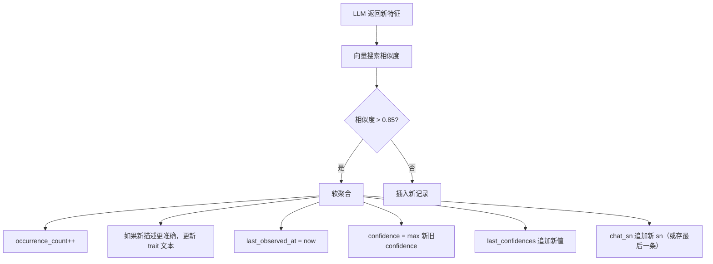

# 特征数据模型深入讨论：重复、频率与时间维度

## 问题的本质

你说得对——**"重复"本身就是关键信号**。一个特征被观测到 1 次和被观测到 10 次，含义完全不同：

| 场景 | LLM 看到 1 条 | LLM 看到 10 条 |
|------|--------------|---------------|
| 用户1年前说"好累" | 可能是偶然状态 | — |
| 用户2周前又说"好累" | 两个独立记录 | — |
| 用户今天还说"好累" | 三个独立记录 | **模式显现：长期疲劳** |
| **如果合并为1条** | "好累" | 丢失了"3次/1年"这个关键信息 |

所以核心问题是：**我们到底在去什么重？**

---

## 当前数据模型的问题

当前 `traits` 表结构：

```sql
traits (
    id, user_id, trait, category, confidence, half_life,
    privacy_level, chat_sn, create_at, update_at
)
```

| 问题 | 表现 |
|------|------|
| **无频率信息** | "好累"出现1次和10次，记录一样 |
| **无时间跨度** | 只有 create_at/update_at，没有"首次观测时间" |
| **去重即丢失信息** | 合并后不知道"被观测了多少次" |
| **半衰期过于简单** | half_life 只有 short/medium/long/permanent 四级，无法表达"间歇性高频"的模式 |

---

## 选型分析：三种数据模型方案

### 方案A：单表 + 频率字段（推荐 ⭐）

在现有 `traits` 表上增加字段，不做"硬去重"，而是做"软聚合"：

```sql
CREATE TABLE IF NOT EXISTS traits (
    id                BIGSERIAL PRIMARY KEY,
    user_id           BIGINT       NOT NULL REFERENCES users(id) ON DELETE CASCADE,
    trait             TEXT         NOT NULL,
    category          INTEGER      NOT NULL,
    confidence        INTEGER      NOT NULL,        -- 当前置信度
    half_life         INTEGER      NOT NULL,         -- 半衰期
    privacy_level     INTEGER      NOT NULL DEFAULT 0,

    -- 新增字段
    occurrence_count  INTEGER      NOT NULL DEFAULT 1,  -- 观测次数
    first_observed_at TIMESTAMPTZ,                       -- 首次观测时间
    last_confidences  TEXT,        -- "95,80,85" CSV格式，存每次的confidence值

    chat_sn           TEXT         NOT NULL DEFAULT '',
    create_at         TIMESTAMPTZ  NOT NULL DEFAULT NOW(),
    update_at         TIMESTAMPTZ  NOT NULL DEFAULT NOW()
);
```

**写入逻辑**：



**查询时的呈现**：

当 LLM 通过 `search_traits` 查询时，返回的不再是原始文本，而是带频率信息的增强文本：

| 已有记录 | LLM 看到的 |
|----------|-----------|
| `{trait:"好累", count:3, first:1年前, last:今天}` | "好累（已观测3次，跨度1年，最近：今天）" |
| `{trait:"会Python", count:1, half_life:permanent}` | "会Python" |
| `{trait:"每天跑步", count:12, first:6月前, last:3天前}` | "每天跑步（高频习惯，近半年观测12次）" |

**优点**：
- 数据模型简单，只需加字段，不加表
- 频率信息完整保留，不丢失
- LLM 能看到"模式"而非"单点"
- 与现有 `traits` 表查询兼容（`ListAllTraitsByCreateTime` 只需稍作修改）

**缺点**：
- 向量搜索时，聚合后的单条记录与多个观测共享同一个向量——需要决定向量的更新策略
- "好累 3次"和"好累 1次"的语义向量不同，但用同一个 embedding

---

### 方案B：双表模型（Cluster + Observations）

将"特征定义"和"特征观测"分离：

```sql
-- 特征定义（每个唯一特征一条记录）
CREATE TABLE trait_definitions (
    id                BIGSERIAL PRIMARY KEY,
    user_id           BIGINT       NOT NULL REFERENCES users(id) ON DELETE CASCADE,
    canonical_trait   TEXT         NOT NULL,         -- 规范化描述
    category          INTEGER      NOT NULL,
    half_life         INTEGER      NOT NULL,
    privacy_level     INTEGER      NOT NULL DEFAULT 0,
    occurrence_count  INTEGER      NOT NULL DEFAULT 1,
    first_observed_at TIMESTAMPTZ,
    last_observed_at  TIMESTAMPTZ,
    avg_confidence    FLOAT,
    trend             TEXT,        -- 'increasing','stable','decreasing','one_off'
    create_at         TIMESTAMPTZ  NOT NULL DEFAULT NOW(),
    update_at         TIMESTAMPTZ  NOT NULL DEFAULT NOW()
);

-- 特征观测（每次观测一条记录）
CREATE TABLE trait_observations (
    id             BIGSERIAL PRIMARY KEY,
    definition_id  BIGINT       NOT NULL REFERENCES trait_definitions(id) ON DELETE CASCADE,
    chat_sn        TEXT         NOT NULL DEFAULT '',
    trait_text     TEXT         NOT NULL,         -- 原文描述
    confidence     INTEGER      NOT NULL,
    create_at      TIMESTAMPTZ  NOT NULL DEFAULT NOW()
);

-- 向量仍挂在 definition 上（一个定义一个向量）
CREATE TABLE trait_vectors (
    trait_id  BIGINT PRIMARY KEY REFERENCES trait_definitions(id) ON DELETE CASCADE,
    embedding VECTOR({dimension})
);
```

**优点**：
- 数据完全规范化，不冗余
- 可以查询所有观测的时间线（哪天说了什么）
- 趋势分析更准确（按观测时间排序即可知道变化）
- 向量搜索只需搜索 definitions 表（数据量小，速度快）

**缺点**：
- 写入时需操作两张表 + 事务保障
- 查询时需 JOIN，复杂度增加
- 现有 `traits` 表的查询代码需要大幅改造

---

### 方案C：保持现有结构 + 查询时聚合

不修改数据库结构，每次插入时仍然插入独立记录。但在 `search_traits` 查询时做实时聚合：

```go
// 查询时实时聚合
func (s *BrainStore) SearchAndAggregate(ctx context.Context, userID int64, 
    queryVector []float32, category int, topK int) ([]AggregatedTrait, error) {
    
    // 1. 向量搜索：获取 topK*3 条最相似记录（扩大召回）
    rawTraits, _ := s.SearchByVector(userID, queryVector, category, topK*3)
    
    // 2. 在应用层做相似度聚类
    clusters := clusterSimilarTraits(rawTraits, 0.85)
    
    // 3. 聚合为最终结果
    result := make([]AggregatedTrait, 0, len(clusters))
    for _, cluster := range clusters {
        result = append(result, AggregatedTrait{
            Trait:           cluster[0].Trait,  // 取最相关的一条
            OccurrenceCount: len(cluster),
            FirstObserved:   cluster[len(cluster)-1].CreateAt,
            LastObserved:    cluster[0].CreateAt,
            AvgConfidence:   avg(cluster, func(t) t.Confidence),
            RelatedSNs:      extractSNs(cluster),
        })
    }
    return result[:min(len(result), topK)], nil
}
```

**优点**：
- 不改数据库结构，零迁移成本
- 保留所有原始数据，不丢失信息
- 聚合逻辑在应用层，随时可调

**缺点**：
- 需要召回更多记录（topK*3），查询效率降低
- 应用层聚类逻辑复杂（需要二次向量比较）
- 随着数据增长，查询越来越慢

---

## 半衰期（half_life）的重新思考

现有 `half_life` 是设计文档中定义的，但当前实现中似乎没有真正使用它来做衰减计算。我建议将 half_life 和 `occurrence_count` 结合起来：

| half_life | 单独出现 | 高频出现（count ≥ 3） |
|-----------|---------|---------------------|
| short | 临时状态，很快过期 | "间歇性反复出现" → 实际是长期模式 |
| medium | 中期特征 | "周期性特征" |
| long | 稳定特征 | "非常稳定的特征" |
| permanent | 永久特征 | — |

**核心洞察**：**高频重复出现的"短半衰期"特征，实际上意味着它是一个"长期模式"，应当升级半衰期。**

例如：用户每周都说"好累"（short half-life × 高频）→ 实际上是一个长期的压力/疲劳模式 → 应自动升级为 medium 或 long half-life。

```go
func computeHalfLife(halfLife int, occurrenceCount int, firstObserved time.Time) int {
    if occurrenceCount < 3 {
        return halfLife  // 频率不够，维持原有半衰期
    }
    
    span := time.Since(firstObserved)
    frequency := float64(occurrenceCount) / span.Hours() * 24 // 每天出现次数
    
    switch {
    case frequency > 0.1 && halfLife < 3:  // 每10天至少出现1次
        return halfLife + 1  // 升级半衰期
    case frequency > 1.0:                  // 每天出现
        return 3  // 直接升级为 long
    default:
        return halfLife
    }
}
```

---

## 关于"重复即信息"的进一步推论

**推论1：特征不仅分"有无"，还分"强弱"**

| 强度层级 | 含义 | 示例 |
|----------|------|------|
| 1（单次） | 用户偶然提到 | "今天天气真好" |
| 2（多次） | 用户反复强调 | 3次说"好累" |
| 3（强化） | 用户主动深入描述 | "我长期失眠导致每天都很累" |
| 4（确认） | 用户确认AI的判断 | "对，我就是这样" |

**推论2：特征的时效性由"最后观测时间"而非"创建时间"决定**

当前 `create_at` 是第一次提取的时间。但更应该关注 `last_observed_at`：
- "好累" 1年前第一次被提取，上周又被提取 → 仍然是活跃特征
- "好累" 1年前唯一一次被提取 → 可能已过期

**推论3：`chat_sn` 应存"最近一次"还是"所有来源"？**

当前 `chat_sn` 只存一个 SN。对高频特征，建议改为存"最近一次"的 SN，同时用 `occurrence_count` 表示广度。

---

## 最终推荐

### 第一阶段：最小改动

采用 **方案A（单表 + 频率字段）**，仅增加 3 个字段：

```sql
ALTER TABLE traits ADD COLUMN occurrence_count  INTEGER NOT NULL DEFAULT 1;
ALTER TABLE traits ADD COLUMN first_observed_at TIMESTAMPTZ;
ALTER TABLE traits ADD COLUMN last_confidence   TEXT DEFAULT '';
```

`first_observed_at` 初始化为当前 `create_at`（兼容旧数据）。

### 第二阶段：增强查询

修改 `search_traits` 工具和 `ListAllTraitsByCreateTime`，返回带频率信息的增强文本：

```
从 "好累" → "好累（观测3次，跨度1年）"
```

### 第三阶段：半衰期自动化

实现自动半衰期升级逻辑，让高频重复的特征获得更长的半衰期。
