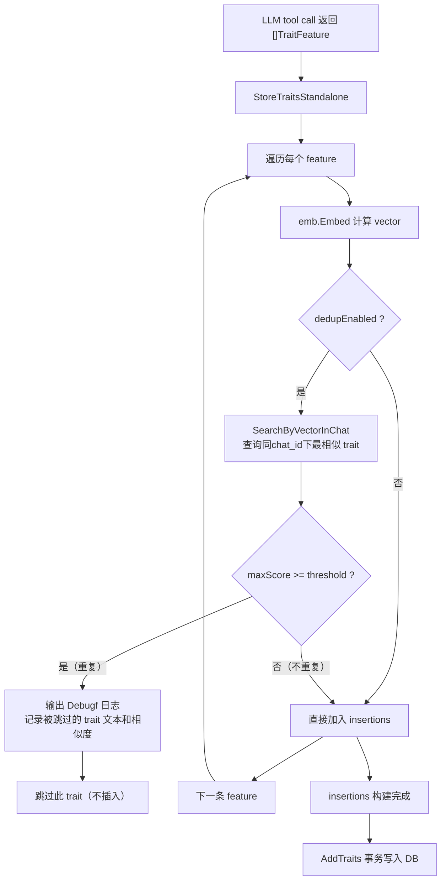

# Trait 入库前基于 embedding 相似度的去重过滤方案

## 目标

在每一条 trait 入库前，检查同一 `chat_id` 下是否已存在 embedding 相似度高于配置阈值的 trait，若存在则跳过（不重复记录）。通过 `[trait-extraction-task]` 中的独立字段控制是否启用去重及阈值。

---

## 数据流变更



---

## 修改文件清单

### 1. [`internal/config/config.go`](internal/config/config.go) — 配置结构体

在 [`TraitExtractionTaskConfig`](internal/config/config.go:437) 中增加两个字段：

```go
// DeduplicateEnabled 是否启用 trait embedding 去重过滤。
// 启用后，新 trait 与同 chat 下已有 trait 的 embedding 相似度
// 超过 DeduplicateThreshold 时，视为重复并跳过入库。
DeduplicateEnabled bool `toml:"deduplicate_enabled"`

// DeduplicateThreshold 是去重相似度阈值（0.0-1.0），仅当
// DeduplicateEnabled = true 时生效。余弦相似度 >= 此值视为重复。
// 建议值：0.95。
DeduplicateThreshold float64 `toml:"deduplicate_threshold"`
```

在 [`DefaultConfig()`](internal/config/config.go:123) 中设置默认值：
```go
DeduplicateEnabled:   false,      // 默认关闭去重，向后兼容
DeduplicateThreshold: 0.95,       // 建议值
```

### 2. [`bin.template/settings_template/server.template.toml`](bin.template/settings_template/server.template.toml) — 配置模板

在 `[trait-extraction-task]` 节添加配置项：

```toml
# trait 入库去重开关（可选）
# 启用后，新提取的 trait 会与同 chat 下已有 trait 做 embedding 相似度比对，
# 相似度超过 deduplicate_threshold 时视为重复，跳过入库。
# 默认 false（关闭去重）。
deduplicate_enabled = false

# embedding 相似度去重阈值（0.0-1.0），仅 deduplicate_enabled = true 时生效。
# 建议值：0.95。
deduplicate_threshold = 0.95
```

### 3. [`internal/store/traits.go`](internal/store/traits.go) — 存储层

新增 [`SearchByVectorInChat`](internal/store/traits.go:87) 方法，在现有关联的相似度搜索基础上增加 `chat_id` 过滤：

```go
// SearchByVectorInChat performs vector similarity search scoped to a specific chat.
// userID is required for data isolation.
func (s *BrainStore) SearchByVectorInChat(userID int64, chatID int64, query []float32, topK int) ([]PersonalTrait, error)
```

SQL 相比 [`SearchByVector`](internal/store/traits.go:89) 增加 `AND t.chat_id = $N` 条件。返回结果包含 `Score`（`1.0 - distance`）。

### 4. [`internal/agent/on_traits.go`](internal/agent/on_traits.go) — 业务逻辑层

#### 4a. 修改 [`StoreTraitsStandalone`](internal/agent/on_traits.go:404) 函数签名

增加 `dedupEnabled bool` 和 `dedupThreshold float64` 两个参数：

```go
func StoreTraitsStandalone(ctx context.Context, features []TraitFeature, chatID int64, userID int64,
    upToMsgID int64, emb embedder.Embedder, apiKey string, dedupEnabled bool, dedupThreshold float64) (int, error)
```

在 [第 413 行](internal/agent/on_traits.go:413) `emb.Embed(ctx, f.FeatureText, apiKey)` 之后，构建 `TraitInsertion` 之前，插入去重逻辑。使用 `logger.TheLogger()` 输出调试日志：

```go
// 去重检查：当 dedupEnabled 时，查询同 chat 下最相似的已有 trait
if dedupEnabled {
    existingTraits, err := theBrainStore.SearchByVectorInChat(userID, chatID, vector, 1)
    if err != nil {
        // 查询失败不阻断流程
    } else if len(existingTraits) > 0 && existingTraits[0].Score >= dedupThreshold {
        // 相似度超过阈值，视为重复，跳过入库
        logger.TheLogger().Debugf("dedup: skip duplicate trait %q in chat %d (score=%.4f >= threshold=%.4f)",
            f.FeatureText, chatID, existingTraits[0].Score, dedupThreshold)
        continue
    }
}
```

#### 4b. 修改 [`storeTraitsInSession`](internal/agent/on_traits.go:262)（HTTP 路径）

从 `ChatAgent` 中读取配置，传递给 `StoreTraitsStandalone`：

```go
func (h *ChatAgent) storeTraitsInSession(ctx context.Context, sess *session.Session, 
    features []traitsFeature, chatID int64, upToMsgID int64) (int, error) {
    emb := sessionEmbedder(sess)
    apiSetting := sessionEmbedderApiSetting(sess)
    return StoreTraitsStandalone(ctx, features, chatID, sess.User.ID, upToMsgID, 
        emb, apiSetting.ApiKey, h.dedupEnabled, h.dedupThreshold)
}
```

### 5. [`internal/agent/on_chat.go`](internal/agent/on_chat.go) — ChatAgent 结构体

#### 5a. 给 [`ChatAgent`](internal/agent/on_chat.go:226) 增加字段

```go
type ChatAgent struct {
    sessionManager *session.Manager
    cookieName     string
    defaultLang    string
    avatarDir      string
    smsCodeCache   *cache.SMSCodeCache
    logger         zylog.Logger
    dedupEnabled   bool     // <-- 新增
    dedupThreshold float64  // <-- 新增
}
```

#### 5b. 修改 [`NewChatHandler`](internal/agent/on_chat.go:436) 函数签名

增加 `dedupEnabled bool` 和 `dedupThreshold float64` 参数，存入 `ChatAgent` 结构体。

### 6. [`internal/agent/init.go`](internal/agent/init.go) — Agent 初始化

修改 [`InitAgent`](internal/agent/init.go:93) 中的 `NewChatHandler` 调用：

```go
chatHandler := NewChatHandler(
    cookieName,
    defaultLang,
    avatarDir,
    logger,
    gcCfg,
    cfg.TraitExtractionTask.DeduplicateEnabled,
    cfg.TraitExtractionTask.DeduplicateThreshold,
)
```

### 7. [`internal/tasks/traits_job.go`](internal/tasks/traits_job.go) — 定时任务路径

#### 7a. 修改 [`RegisterPeriodicTraitExtraction`](internal/tasks/traits_job.go:40)

增加 `dedupEnabled bool` 和 `dedupThreshold float64` 参数，存储到闭包中。

#### 7b. 修改 [`runPeriodicTraitExtraction`](internal/tasks/traits_job.go:71)

传递 `dedupEnabled` 和 `dedupThreshold` 到 `processChatForExtraction`。

#### 7c. 修改 [`processChatForExtraction`](internal/tasks/traits_job.go:134)

在 [第 229 行](internal/tasks/traits_job.go:229) 调用 `StoreTraitsStandalone` 时传入：

```go
storedCount, err := agent.StoreTraitsStandalone(ctx, result.Features, row.ID, row.UserID, 
    lastMsgID, embedderClient, embedderAPIKey, dedupEnabled, dedupThreshold)
```

### 8. [`cmd/server/main.go`](cmd/server/main.go) — 启动入口

在 [第 202 行](cmd/server/main.go:202) 调用 `RegisterPeriodicTraitExtraction` 时加入两个新参数：

```go
tasks.RegisterPeriodicTraitExtraction(
    cfg.TraitExtractionTask,
    agent.GetChatStore(),
    agent.GetBrainStore(),
    agent.GetLLMClients(),
    agent.GetEmbedderClients(),
    theLogger,
    defaultLang,
    cfg.TraitExtractionTask.DeduplicateEnabled,
    cfg.TraitExtractionTask.DeduplicateThreshold,
)
```

---

## 影响范围分析

| 文件 | 改动类型 | 影响 |
|------|----------|------|
| `internal/config/config.go` | 加 2 个字段 + 默认值 | 默认 `false`，零影响 |
| `bin.template/.../server.template.toml` | 加注释和配置项 | 仅模板，不影响运行 |
| `internal/store/traits.go` | 新增 `SearchByVectorInChat` | 纯新增 |
| `internal/agent/on_traits.go` | 签名 + 去重逻辑 + Debugf 日志 | 调用方需更新参数 |
| `internal/agent/on_chat.go` | `ChatAgent` 加 2 字段 + `NewChatHandler` 签名 | 构造方需更新 |
| `internal/agent/init.go` | 传参 | 一处修改 |
| `internal/tasks/traits_job.go` | 传参链 | 三处修改 |
| `cmd/server/main.go` | 传参 | 一处修改 |

---

## 向后兼容性

- `DeduplicateEnabled` 默认 `false`，去重逻辑完全跳过，**零影响**
- `SearchByVectorInChat` 纯新增，不影响现有查询
