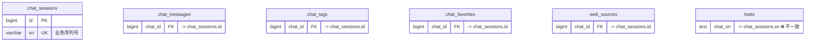
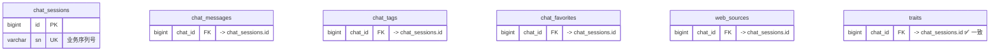
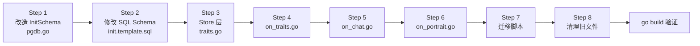

# 改造计划：traits 表外键从 chat_sn 改为 chat_id + InitSchema 优化

## 问题描述

### 问题 1：traits 表外键不一致

当前 [`traits`](deploy/settings_template/init.template.sql:139) 表中的 `chat_sn` 字段通过应用逻辑关联到 [`chat_sessions`](deploy/settings_template/init.template.sql:49) 的 `sn`（字符串UUID），而不是使用 `chat_sessions` 的 `id`（BIGINT 主键）。

其他所有关联表都统一使用 `chat_sessions.id`：
- [`chat_messages`](deploy/settings_template/init.template.sql:74)（`chat_id`）
- [`chat_tags`](deploy/settings_template/init.template.sql:111)（`chat_id`）
- [`chat_favorites`](deploy/settings_template/init.template.sql:126)（`chat_id`）
- [`web_sources`](deploy/settings_template/init.template.sql:92)（`chat_id`）

`traits` 是唯一不统一的表。

### 问题 2：InitSchema 硬编码文件名

当前 [`InitSchema`](internal/store/pgdb.go:66) 硬编码查找 `bin/settings/init.sql`，而实际目录中存放的是 `--init.sql`（以 `-` 开头表示禁用）。改为从 `bin/settings/init_sql/` 子目录下读取 SQL 文件。

## 当前架构



## 目标架构



## 修改清单

### Step 1：改造 InitSchema — [`internal/store/pgdb.go`](internal/store/pgdb.go:66)

**当前逻辑：** 硬编码查找 `bin/settings/init.sql`。

**目标逻辑：**

```
bin/settings/
├── init_sql/          <-- 新建子目录，存放启动时需执行的 SQL
│   └── init.sql       <-- 实际的 schema SQL 文件（不带 '-' 前缀）
├── --init.sql         <-- 旧的禁用文件，可清理或保留
└── ...其他配置...
```

`InitSchema` 函数新的行为：
1. 尝试读取 `bin/settings/init_sql/` 目录
2. 该目录下扫描 `.sql` 文件
3. 必须且只能找到一个 `.sql` 文件（否则报错退出）
4. 读取并执行该 SQL 文件（现有替换 `{dimension}` 和检查 pgvector 的逻辑保留）

```go
func InitSchema(dimension int) error {
    const sqlDir = "bin/settings/init_sql"
    
    entries, err := os.ReadDir(sqlDir)
    if err != nil {
        if os.IsNotExist(err) { return nil }  // 目录不存在则跳过
        return fmt.Errorf("failed to read %s. %w", sqlDir, err)
    }
    
    // 过滤出 .sql 文件
    var sqlFiles []string
    for _, e := range entries {
        if !e.IsDir() && strings.HasSuffix(e.Name(), ".sql") {
            sqlFiles = append(sqlFiles, e.Name())
        }
    }
    
    // 必须恰好找到一个
    if len(sqlFiles) == 0 {
        return nil  // 没有 SQL 文件，跳过
    }
    if len(sqlFiles) > 1 {
        return fmt.Errorf("发现 %d 个 SQL 文件在 %s，只允许一个", len(sqlFiles), sqlDir)
    }
    
    // 读取并执行
    schemaBytes, err := os.ReadFile(filepath.Join(sqlDir, sqlFiles[0]))
    // ... 后续逻辑不变 ...
}
```

### Step 2：修改数据库 Schema — [`deploy/settings_template/init.template.sql`](deploy/settings_template/init.template.sql:147)

| 修改项 | 原内容 | 新内容 |
|--------|--------|--------|
| 列定义 | `chat_sn TEXT NOT NULL DEFAULT ''` | `chat_id BIGINT NOT NULL REFERENCES chat_sessions(id) ON DELETE CASCADE` |
| 索引 | `idx_traits_chat_sn ON traits(chat_sn)` | `idx_traits_chat_id ON traits(chat_id)` |

### Step 3：修改 Store 层 — [`internal/store/traits.go`](internal/store/traits.go:20)

#### 3.1 `PersonalTrait` 结构体

| 字段 | 原 | 新 |
|------|----|----|
| Go 字段 | `ChatSN string` | `ChatID int64` |
| db tag | `` `db:"chat_sn"` `` | `` `db:"chat_id"` `` |
| 零值判断 | `chatSN == ""` | `chatID == 0` |

#### 3.2 SQL 语句修改（所有用到 `chat_sn` 的地方）

| 方法 | 原 SQL | 新 SQL |
|------|--------|--------|
| `AddTrait` | `INSERT INTO traits(... chat_sn) VALUES(... $7)` | `INSERT INTO traits(... chat_id) VALUES(... $7)` |
| `AddTraits` | 同上 | 同上 |
| `SearchByVector` | `t.chat_sn` | `t.chat_id` |
| `SearchByKeyword` | `t.chat_sn` | `t.chat_id` |
| `SearchByKeywordFuzzy` | `t.chat_sn` | `t.chat_id` |
| `ListTraitsByChat` | `WHERE chat_sn = $1` | `WHERE chat_id = $1` |
| `ListAllTraitsByCreateTime` | `t.chat_sn` | `t.chat_id` |

#### 3.3 方法签名变更

| 方法 | 原 | 新 |
|------|----|----|
| `DeleteByChatSN` | `(chatSN string) (int, error)` | `(chatID int64) (int, error)` |
| `DeleteTraitsByChatSNs` | `(chatSNs []string) (int, error)` | `(chatIDs []int64) (int, error)` |
| `ListTraitsByChat` | `(chatSN string) ([]PersonalTrait, error)` | `(chatID int64) ([]PersonalTrait, error)` |

### Step 4：修改 Agent 层 — [`internal/agent/on_traits.go`](internal/agent/on_traits.go:312)

#### `storeTraitsInSession()` 方法

| 参数 | 原 | 新 |
|------|----|----|
| 参数名 | `chatSN string` | `chatID int64` |
| 调用处 | `ChatSN: chatSN` | `ChatID: chatID` |

#### `OnExtractTraits()` 方法 — 第 155 行

| 调用 | 原 | 新 |
|------|----|----|
| `storeTraitsInSession` 传参 | `foundChat.SN` | `foundChat.ID` |

### Step 5：修改 Agent 层 — [`internal/agent/on_chat.go`](internal/agent/on_chat.go:150)

#### `OnPermanentDelete()` 方法 — 第 165-166 行

| 原 | 新 |
|----|----|
| `theBrainStore.DeleteByChatSN(sn)` | `theBrainStore.DeleteByChatID(chatID)` |

#### `OnEmptyTrash()` 方法 — 第 198-208 行

| 原 | 新 |
|----|----|
| `sns := make([]string, 0, ...)` 收集 `c.SN` | `chatIDs := make([]int64, 0, ...)` 收集 `c.ID` |
| `DeleteTraitsByChatSNs(sns)` | `DeleteTraitsByChatIDs(chatIDs)` |

### Step 6：修改 Agent 层 — [`internal/agent/on_portrait.go`](internal/agent/on_portrait.go:443)

#### `computePortraitInfo()` 方法

| 行 | 原 | 新 |
|----|----|----|
| 444 | `chatSNSet := make(map[string]struct{})` | `chatIDSet := make(map[int64]struct{})` |
| 446-448 | `if t.ChatSN != "" { chatSNSet[t.ChatSN] = ... }` | `if t.ChatID != 0 { chatIDSet[t.ChatID] = ... }` |

### Step 7：创建数据迁移脚本

新建 `deploy/migrations/001_traits_chat_sn_to_chat_id.sql`：

```sql
-- 回填 chat_id（对应 chat_sessions.id）
-- PostgreSQL 支持 DDL 事务，整个迁移可以放在一个事务中
BEGIN;

UPDATE traits t
SET chat_id = cs.id
FROM chat_sessions cs
WHERE t.chat_sn = cs.sn;

-- 删除无法关联的脏数据
DELETE FROM traits WHERE chat_id IS NULL OR chat_id = 0;

-- 设为 NOT NULL
ALTER TABLE traits ALTER COLUMN chat_id SET NOT NULL;

-- 删除旧索引，创建新索引
DROP INDEX IF EXISTS idx_traits_chat_sn;
CREATE INDEX IF NOT EXISTS idx_traits_chat_id ON traits(chat_id);

COMMIT;
```

### Step 8：清理旧文件

删除或忽略 `bin/settings/--init.sql`，改为使用 `bin/settings/init_sql/init.sql`。

## 执行顺序



## 关于 PostgreSQL 事务支持问题的回答

**Q：PostgreSQL 支持这类语句的事务吗？**

A：**支持**。PostgreSQL 的 DDL（`CREATE TABLE`、`ALTER TABLE`、`CREATE INDEX`、`DROP INDEX` 等）都是**事务性**的，可以放在 `BEGIN`/`COMMIT` 块中安全执行。如果其中某条语句失败，整个事务会回滚，不会留下部分变更。

唯一不能放在事务块里的是一些 `CONCURRENTLY` 操作（如 `CREATE INDEX CONCURRENTLY`、`REINDEX CONCURRENTLY`），但我们用普通 `CREATE INDEX` 就没有这个问题。

所以迁移脚本可以安全地用事务包裹。

## 风险与注意事项

1. **现有数据迁移**：如果生产环境已有 traits 数据，必须执行迁移脚本回填 `chat_id`
2. **ON DELETE CASCADE**：新字段是真正 FK + CASCADE，删除 chat_session 时会自动删除关联 traits。代码中主动调用 DeleteByChatID 是安全的冗余删除
3. **init_sql 目录**：必须恰好有一个 `.sql` 文件，否则报错退出——这是有意设计，防止误操作
4. **SQL 查询性能**：`chat_id` 是 BIGINT，JOIN 和索引效率优于字符串类型的 `sn`
5. **前端 API 不受影响**：`POST /api/chat/traits` 请求体中传的 `sn` 字段用于 ChatAgent 内部查找 chat，不在本变更范围内
