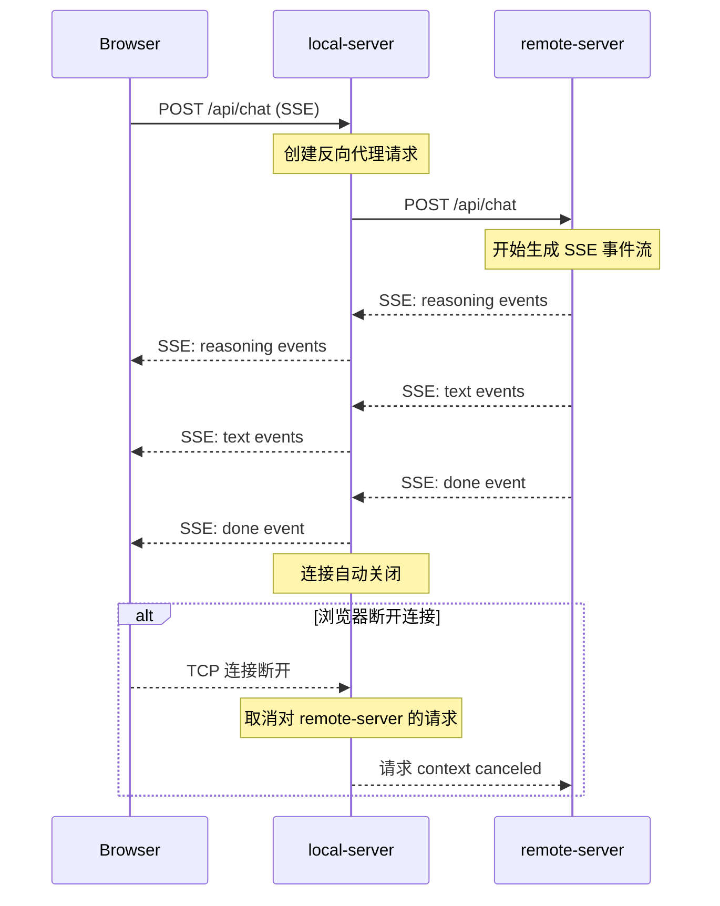

# BrainForever 三层架构 & 双可执行文件构建方案

## 一、背景分析

### 当前架构（单体）

```
浏览器 → [brain-forever 单体二进制] → LLM API / 数据库
         └─ 同时服务前端静态文件 + API 后端
```

**现状问题：**
- 单一日志文件、统一配置，无法区分本地与远程环境
- 前端静态文件和 API 后端耦合在同一个进程中
- 无法分别部署本地代理层和远程服务层

### 目标架构（三层）

```
浏览器 → 本地 WEB 端 (Go) → 远程 WEB 端 (Go) → LLM API / 数据库
         local-server          remote-server
```

## 二、目录结构调整方案

### 建议方案：Go 标准 `cmd/` 模式 + 共享 `internal/` 代码

```
brain-forever/
├── cmd/                          ← 新增：各可执行文件的 main 入口
│   ├── local-server/             ← 本地 WEB 端
│   │   └── main.go               ─ 服务前端 + 反向代理到 remote-server
│   └── remote-server/            ← 远程 WEB 端
│       └── main.go               ─ 原 main.go 拆分出的后端服务
│
├── internal/
│   ├── agent/                    ← 共享：Chat agent 业务逻辑
│   ├── config/                   ← 共享：配置结构体
│   ├── logger/                   ← 共享：日志
│   ├── store/                    ← 共享：数据库操作
│   └── server/                   ← 新增：服务端公共代码
│       ├── remote/
│       │   ├── handler.go        ─ 从原 main.go 提取的路由注册
│       │   └── server.go         ─ 从原 main.go 提取的服务启动逻辑
│       └── local/
│           ├── proxy.go          ─ 反向代理 remote-server
│           └── server.go         ─ 本地服务启动逻辑
│
├── infra/                        ← 共享：基础设施层（LLM、Embedder 等）
├── frontend/                     ← 仅由 local-server 服务
├── lang/                         ← 共享：i18n
├── data/                         ← 运行时数据（仅 remote-server 使用）
├── go.mod                        ← 保持单一 module，两个 binary 共享
│
├── b.sh                          ← 更新：同时构建两个 binary
├── b.bat                         ← 更新：同时构建两个 binary
└── brain-forever.ps1             ← 调整：指向 local-server
```

### 关键设计原则

1. **单一 Go Module**：保持 `module BrainForever` 不变，两个 `cmd/*/main.go` 共享所有 `internal/` 和 `infra/` 包
2. **`internal/` 可见性**：Go 的 `internal` 包在同一个 module 内的多个 binary 之间完全可见，无需额外配置
3. **最小化代码移动**：仅从原 `main.go` 提取路由注册和服务启动逻辑到 `internal/server/`，其余代码保持不变

## 三、两个可执行文件的职责拆分

### 3.1 remote-server（远程 WEB 端）

```go
// cmd/remote-server/main.go
// 职责：完整的后端服务
// - 所有 API handler（/api/chat, /api/session, ...）
// - 数据库操作（SQLite）
// - LLM、Embedder、VectorStore、WebSearch
// - 无前端静态文件服务
// - 无 CORS 中间件（由 local-server 处理）
```

**配置变化：**
- 移除 `PROXY_ADDR` → 改用 `REMOTE_ADDR` (默认 `[::]:9090`)
- 新增 `LOCAL_SERVER_ORIGIN` 用于 CORS 白名单（可选）
- 移除 `DEV_CACHE_DISABLE`（本地服务器处理缓存）

### 3.2 local-server（本地 WEB 端）

```go
// cmd/local-server/main.go
// 职责：轻量级代理层
// - 服务前端静态文件（frontend/）
// - 反向代理 /api/* 到 remote-server
// - SSE 流式透传
// - 本地端口绑定
```

**配置项：**
- `LOCAL_ADDR` (默认 `[::]:8080`) — 本地监听地址
- `REMOTE_URL` (默认 `http://localhost:9090`) — 远程服务地址
- `DEV_CACHE_DISABLE` — 开发模式禁用缓存

## 四、通信协议：本地 → 远程

### HTTP 请求代理流程

```
浏览器                    local-server                 remote-server
  │                          │                             │
  │── GET /index.html ──────→│ (直接返回静态文件)           │
  │←─ index.html ────────────│                             │
  │                          │                             │
  │── POST /api/chat ───────→│                             │
  │                          │── POST /api/chat ──────────→│
  │                          │    (SSE 流式响应)            │
  │                          │←── SSE event stream ────────│
  │←── SSE event stream ─────│                             │
  │                          │                             │
  │── GET /api/chat/list ────→│                             │
  │                          │── GET /api/chat/list ──────→│
  │                          │←── JSON response ───────────│
  │←── JSON response ────────│                             │
```

### SSE 流式代理的关键处理

SSE (Server-Sent Events) 是长连接流式响应，代理层必须：

1. **逐行转发**：实时读取 remote-server 的 SSE 数据流并 flushed 到浏览器
2. **连接管理**：浏览器断开时，需取消 remote-server 的请求（避免资源泄露）
3. **超时控制**：可配置 idle 超时
4. **不缓冲响应体**：禁用代理缓冲，确保流式实时性



### Session/Cookie 转发策略

当前使用 HTTP Cookie 进行 session 管理。代理层需要：
- **透传 Cookie**：将浏览器的 Cookie 原样转发到 remote-server
- **Set-Cookie 透传**：将 remote-server 返回的 Set-Cookie 头部原样转发给浏览器

```go
// 反向代理的关键配置（使用 Go 标准库 httputil.ReverseProxy）
proxy := &httputil.ReverseProxy{
    Director: func(req *http.Request) {
        req.URL.Scheme = "http"
        req.URL.Host = remoteAddr
        req.URL.Path = req.URL.Path  // 保持相同路径
        // 保持原始 Host/Cookie 等头部
    },
    ModifyResponse: func(resp *http.Response) error {
        // 透传所有响应头部（包括 Set-Cookie）
        return nil
    },
}
```

### 为什么不用 gRPC/JSON-RPC？

1. **SSE 兼容性**：现有的 SSE 流式架构已深度集成在 HTTP 层面，保持 HTTP 代理最简单
2. **零侵入**：remote-server 的 handler 代码无需任何修改，local-server 只是一个透明代理
3. **开发简洁**：本地开发时甚至可以直接让浏览器直连 remote-server

## 五、GoLand 多构建目标配置

### 方法一：两个 Go Build Run Configuration（推荐）

GoLand 原生支持在 `cmd/` 下为每个 main 包创建独立的运行配置：

1. **创建 Remote Server 配置**
   - `Run` → `Edit Configurations` → `+` → `Go Build`
   - Name: `remote-server`
   - Run kind: `Directory`
   - Directory: `cmd/remote-server`
   - Output directory: `$PROJECT_DIR$`
   - Working directory: `$PROJECT_DIR$`

2. **创建 Local Server 配置**
   - `Run` → `Edit Configurations` → `+` → `Go Build`
   - Name: `local-server`
   - Run kind: `Directory`
   - Directory: `cmd/local-server`
   - Output directory: `$PROJECT_DIR$`
   - Working directory: `$PROJECT_DIR$`

3. **创建复合配置（同时启动两个）**
   - `Run` → `Edit Configurations` → `+` → `Compound`
   - Name: `brain-forever (local + remote)`
   - 勾选 `local-server` 和 `remote-server`

### 方法二：CLI 多目标构建（构建脚本）

```bash
# 构建 remote-server
CGO_ENABLED=1 go build -o remote-server ./cmd/remote-server/

# 构建 local-server
CGO_ENABLED=1 go build -o local-server ./cmd/local-server/
```

## 六、构建脚本更新

### b.sh（Linux/macOS）

```bash
#!/bin/bash
set -e
export CGO_ENABLED=1

echo "=== BrainForever Builder ==="
echo ""

# Tidy
echo "[1/4] go mod tidy..."
go mod tidy

# Build remote-server
echo "[2/4] Building remote-server..."
go build -o remote-server ./cmd/remote-server/

# Build local-server
echo "[3/4] Building local-server..."
go build -o local-server ./cmd/local-server/

echo "[4/4] Build success: remote-server + local-server"
```

### b.bat（Windows）

```batch
@echo off
chcp 65001 >nul
setlocal
set "PATH=C:\msys64\ucrt64\bin;%PATH%"
set "CGO_ENABLED=1"

echo === BrainForever Builder ===
echo.

echo [1/4] go mod tidy...
call go mod tidy

echo [2/4] Building remote-server...
go build -o remote-server.exe .\cmd\remote-server\

echo [3/4] Building local-server...
go build -o local-server.exe .\cmd\local-server\

echo.
echo [4/4] Build success: remote-server.exe + local-server.exe
endlocal
```

## 七、实施步骤清单

### Phase 1：目录结构调整

| # | 步骤 | 文件/操作 | 影响范围 |
|---|------|-----------|---------|
| 1 | 创建 `cmd/remote-server/main.go` | 从当前 `main.go` 复制，移除前端文件服务和缓存控制逻辑 | 新文件 |
| 2 | 创建 `cmd/local-server/main.go` | 前端静态文件服务 + `httputil.ReverseProxy` 代理 `/api/*` | 新文件 |
| 3 | 保留原 `main.go` 或重命名为 `main.go.bak` | 向后兼容 | 1 个文件 |
| 4 | 创建 `internal/server/remote/` | 从 `main.go` 提取路由注册、服务启动代码 | 新目录 |
| 5 | 创建 `internal/server/local/` | 反向代理核心逻辑 | 新目录 |

### Phase 2：代码实现

| # | 步骤 | 描述 | 预估文件数 |
|---|------|------|-----------|
| 1 | 实现 `remote-server/main.go` | 无前端文件服务，纯 API 后端 | 1 |
| 2 | 实现 `local-server/main.go` | 前端文件服务 + 反向代理 | 1 |
| 3 | 更新构建脚本 | `b.sh`、`b.bat` | 2 |
| 4 | 更新启动脚本 | `brain-forever.ps1` | 1 |

### Phase 3：验证

| # | 步骤 | 描述 |
|---|------|------|
| 1 | 启动 remote-server | 验证 API 可正常响应 |
| 2 | 启动 local-server | 验证前端可正常加载 |
| 3 | 端到端测试 | 验证完整聊天流程（含 SSE 流式） |
| 4 | 配置 GoLand Run Configuration | 创建两个 Go Build 配置 |

## 八、不变的内容

- **`internal/` 包**：所有业务逻辑、数据层完全不变
- **`infra/` 包**：所有基础设施代码完全不变
- **`frontend/`**：前端代码完全不变
- **`lang/`**：国际化文件完全不变
- **`go.mod`**: module 名和依赖完全不变
- **API 路由路径**：`/api/*` 完全不变
- **SSE 事件格式**：前端和后端的 SSE 通信协议完全不变

## 九、潜在风险与注意事项

1. **CGO 依赖**：`go-sqlite3` 需要 CGO，remote-server 构建时需 `CGO_ENABLED=1`
2. **SSE 代理超时**：`httputil.ReverseProxy` 默认不处理流式响应超时，需自定义 `Transport`
3. **端口冲突**：建议 local-server 用 8080，remote-server 用 9090，避免开发时端口冲突
4. **文件路径差异**：local-server 的 `frontend/` 路径是相对于其工作目录的，确保运行目录正确
5. **远程部署**：local-server 只在用户本地运行，remote-server 才是实际部署到远程服务器的二进制
